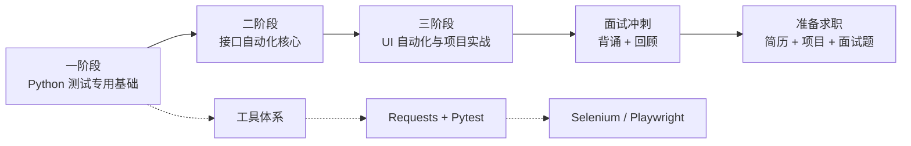

# python-auto-test-study
python自动化测试入门到实战

## 学习路线图




# Python 自动化测试学习
  最终目标：实战 Selenium + Pytest 自动化测试项目

## 目录结构

```
python-auto-test-study/
├── .gitignore
├── README.md
├── requirements.txt
├── docs/
│   ├── 01-搭建环境踩坑.md
│   ├── 02-study自动化测试理论.md
│   └── 03-核心Python基础语法review.md
├── src/
│   ├── base/               # 基础操作封装 (BasePage 等)
│   ├── pages/              # 页面对象 (LoginPage 等)
│   ├── test_cases/         # 测试用例 (test_login.py 等)
│   ├── utils/              # 工具函数 (日志、截图等)
│   └── exercises/          # Python 练习代码 (语法、类、异常等)
└── config/                 # 配置文件目录
```

## 学习进度
```
- 01 环境搭建完成 ✅
     miniforge+pycharm+git+github
- 02 Python 基础学习中 🔄
     core python programing 书太厚太全面了跟着敲代码还是学了就忘。
     Python 基础语法回顾（面向自动化测试）
     目标复习自动化测试高频用到的 Python 语法，夯实基础。

    ### 学习重点
    1.  类与继承：`class BasePage` 封装基础操作，所有页面对象继承
    2.  异常处理：`try-except` 捕获元素定位超时、操作失败
    3.  文件与配置读取：`configparser` 读取 `.ini` 配置文件
    4.  列表/字典/循环：处理测试数据、批量执行用例
```