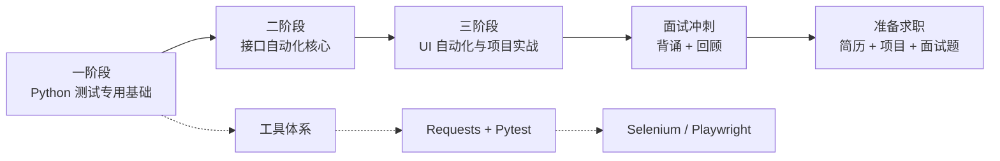

# python-auto-test-study
python自动化测试入门到实战

## 学习路线图




# Python 自动化测试学习
  最终目标：实战 Selenium + Pytest 自动化测试项目

## 目录结构

<!-- PROJECT_STRUCTURE_START -->
```
PythonAutoTest/
├── docs/
│   ├── 01_搭建环境踩坑.md
│   └── 02_测试理论.md
├── jenkins_home/
│   ├── jobs/
│   ├── logs/
│   │   └── health-checker.log
│   ├── plugins/
│   │   ├── allure-jenkins-plugin/
│   │   │   ├── img/
│   │   │   │   └── icon.png
│   │   │   ├── META-INF/
│   │   │   │   ├── maven/
│   │   │   │   │   └── org.allurereport.jenkins/
│   │   │   │   │       └── allure-jenkins-plugin/
│   │   │   │   │           ├── pom.properties
│   │   │   │   │           └── pom.xml
│   │   │   │   └── MANIFEST.MF
│   │   │   └── WEB-INF/
│   │   │       ├── lib/
│   │   │       │   ├── allure-jenkins-plugin.jar
│   │   │       │   ├── annotations-3.0.0.jar
│   │   │       │   ├── truezip-driver-file-7.7.10.jar
│   │   │       │   ├── truezip-driver-zip-7.7.10.jar
│   │   │       │   ├── truezip-file-7.7.10.jar
│   │   │       │   ├── truezip-kernel-7.7.10.jar
│   │   │       │   └── truezip-swing-7.7.10.jar
│   │   │       └── licenses.xml
│   │   ├── ant/
│   │   │   ├── META-INF/
│   │   │   │   ├── maven/
│   │   │   │   │   └── org.jenkins-ci.plugins/
│   │   │   │   │       └── ant/
│   │   │   │   │           ├── pom.properties
│   │   │   │   │           └── pom.xml
│   │   │   │   └── MANIFEST.MF
│   │   │   └── WEB-INF/
│   │   │       ├── lib/
│   │   │       │   └── ant.jar
│   │   │       └── licenses.xml
│   │   ├── antisamy-markup-formatter/
│   │   │   ├── META-INF/
│   │   │   │   ├── maven/
│   │   │   │   │   └── org.jenkins-ci.plugins/
│   │   │   │   │       └── antisamy-markup-formatter/
│   │   │   │   │           ├── pom.properties
│   │   │   │   │           └── pom.xml
│   │   │   │   └── MANIFEST.MF
│   │   │   └── WEB-INF/
│   │   │       ├── lib/
│   │   │       │   ├── antisamy-markup-formatter.jar
│   │   │       │   └── owasp-java-html-sanitizer-20220608.1.jar
│   │   │       └── licenses.xml
│   │   ├── apache-httpcomponents-client-4-api/
│   │   │   ├── META-INF/
│   │   │   │   ├── maven/
│   │   │   │   │   └── org.jenkins-ci.plugins/
│   │   │   │   │       └── apache-httpcomponents-client-4-api/
│   │   │   │   │           ├── pom.properties
│   │   │   │   │           └── pom.xml
│   │   │   │   └── MANIFEST.MF
│   │   │   └── WEB-INF/
│   │   │       ├── lib/
│   │   │       │   ├── apache-httpcomponents-client-4-api.jar
│   │   │       │   ├── fluent-hc-4.5.14.jar
│   │   │       │   ├── httpasyncclient-4.1.5.jar
│   │   │       │   ├── httpasyncclient-cache-4.1.5.jar
│   │   │       │   ├── httpclient-4.5.14.jar
│   │   │       │   ├── httpclient-cache-4.5.14.jar
│   │   │       │   ├── httpcore-4.4.16.jar
│   │   │       │   ├── httpcore-nio-4.4.16.jar
│   │   │       │   └── httpmime-4.5.14.jar
│   │   │       └── licenses.xml
│   │   ├── asm-api/
│   │   │   ├── META-INF/
│   │   │   │   ├── maven/
│   │   │   │   │   └── io.jenkins.plugins/
│   │   │   │   │       └── asm-api/
│   │   │   │   │           ├── pom.properties
│   │   │   │   │           └── pom.xml
│   │   │   │   └── MANIFEST.MF
│   │   │   └── WEB-INF/
│   │   │       ├── lib/
│   │   │       │   ├── asm-9.10.jar
│   │   │       │   ├── asm-analysis-9.10.jar
│   │   │       │   ├── asm-api.jar
│   │   │       │   ├── asm-commons-9.10.jar
│   │   │       │   ├── asm-tree-9.10.jar
│   │   │       │   └── asm-util-9.10.jar
│   │   │       └── licenses.xml
│   │   ├── bouncycastle-api/
│   │   │   ├── META-INF/
│   │   │   │   ├── maven/
│   │   │   │   │   └── org.jenkins-ci.plugins/
│   │   │   │   │       └── bouncycastle-api/
│   │   │   │   │           ├── pom.properties
│   │   │   │   │           └── pom.xml
│   │   │   │   └── MANIFEST.MF
│   │   │   └── WEB-INF/
│   │   │       ├── lib/
│   │   │       │   └── bouncycastle-api.jar
│   │   │       └── optional-lib/
│   │   │           ├── bcpg-jdk18on-1.84.jar
│   │   │           ├── bcpkix-jdk18on-1.84.jar
│   │   │           ├── bcprov-jdk18on-1.84.jar
│   │   │           └── bcutil-jdk18on-1.84.jar
│   │   ├── branch-api/
│   │   │   ├── images/
│   │   │   │   └── organization-folder.svg
│   │   │   ├── META-INF/
│   │   │   │   ├── maven/
│   │   │   │   │   └── org.jenkins-ci.plugins/
│   │   │   │   │       └── branch-api/
│   │   │   │   │           ├── pom.properties
│   │   │   │   │           └── pom.xml
│   │   │   │   └── MANIFEST.MF
│   │   │   └── WEB-INF/
│   │   │       ├── lib/
│   │   │       │   └── branch-api.jar
│   │   │       └── licenses.xml
│   │   ├── build-timeout/
│   │   │   ├── META-INF/
│   │   │   │   ├── maven/
│   │   │   │   │   └── org.jenkins-ci.plugins/
│   │   │   │   │       └── build-timeout/
│   │   │   │   │           ├── pom.properties
│   │   │   │   │           └── pom.xml
│   │   │   │   └── MANIFEST.MF
│   │   │   └── WEB-INF/
│   │   │       ├── lib/
│   │   │       │   └── build-timeout.jar
│   │   │       └── licenses.xml
│   │   ├── caffeine-api/
│   │   │   ├── META-INF/
│   │   │   │   ├── maven/
│   │   │   │   │   └── io.jenkins.plugins/
│   │   │   │   │       └── caffeine-api/
│   │   │   │   │           ├── pom.properties
│   │   │   │   │           └── pom.xml
│   │   │   │   └── MANIFEST.MF
│   │   │   └── WEB-INF/
│   │   │       ├── lib/
│   │   │       │   ├── caffeine-3.2.3.jar
│   │   │       │   └── caffeine-api.jar
│   │   │       └── licenses.xml
│   │   ├── checks-api/
│   │   │   ├── META-INF/
│   │   │   │   ├── maven/
│   │   │   │   │   └── io.jenkins.plugins/
│   │   │   │   │       └── checks-api/
│   │   │   │   │           ├── pom.properties
│   │   │   │   │           └── pom.xml
│   │   │   │   └── MANIFEST.MF
│   │   │   └── WEB-INF/
│   │   │       ├── lib/
│   │   │       │   └── checks-api.jar
│   │   │       └── licenses.xml
│   │   ├── cloudbees-folder/
│   │   │   ├── images/
│   │   │   │   ├── 16x16/
│   │   │   │   │   ├── folder-disabled.png
│   │   │   │   │   ├── folder.png
│   │   │   │   │   └── move.png
│   │   │   │   ├── 24x24/
│   │   │   │   │   ├── folder-disabled.png
│   │   │   │   │   ├── folder.png
│   │   │   │   │   └── move.png
│   │   │   │   ├── 32x32/
│   │   │   │   │   ├── folder-disabled.png
│   │   │   │   │   ├── folder.png
│   │   │   │   │   └── move.png
│   │   │   │   ├── 48x48/
│   │   │   │   │   ├── folder-disabled.png
│   │   │   │   │   ├── folder.png
│   │   │   │   │   └── move.png
│   │   │   │   └── svgs/
│   │   │   │       ├── folder-disabled.svg
│   │   │   │       ├── folder-store.svg
│   │   │   │       ├── folder.svg
│   │   │   │       └── move.svg
│   │   │   ├── META-INF/
│   │   │   │   ├── maven/
│   │   │   │   │   └── org.jenkins-ci.plugins/
│   │   │   │   │       └── cloudbees-folder/
│   │   │   │   │           ├── pom.properties
│   │   │   │   │           └── pom.xml
│   │   │   │   └── MANIFEST.MF
│   │   │   └── WEB-INF/
│   │   │       ├── lib/
│   │   │       │   └── cloudbees-folder.jar
│   │   │       └── licenses.xml
│   │   ├── commons-lang3-api/
│   │   │   ├── META-INF/
│   │   │   │   ├── maven/
│   │   │   │   │   └── io.jenkins.plugins/
│   │   │   │   │       └── commons-lang3-api/
│   │   │   │   │           ├── pom.properties
│   │   │   │   │           └── pom.xml
│   │   │   │   └── MANIFEST.MF
│   │   │   └── WEB-INF/
│   │   │       ├── lib/
│   │   │       │   ├── commons-lang3-3.20.0.jar
│   │   │       │   └── commons-lang3-api.jar
│   │   │       └── licenses.xml
│   │   ├── commons-text-api/
│   │   │   ├── META-INF/
│   │   │   │   ├── maven/
│   │   │   │   │   └── io.jenkins.plugins/
│   │   │   │   │       └── commons-text-api/
│   │   │   │   │           ├── pom.properties
│   │   │   │   │           └── pom.xml
│   │   │   │   └── MANIFEST.MF
│   │   │   └── WEB-INF/
│   │   │       ├── lib/
│   │   │       │   ├── commons-text-1.15.0.jar
│   │   │       │   └── commons-text-api.jar
│   │   │       └── licenses.xml
│   │   ├── credentials/
│   │   │   ├── help/
│   │   │   │   └── domain/
│   │   │   │       ├── description_fr.html
│   │   │   │       ├── description_it.html
│   │   │   │       ├── description_ja.html
│   │   │   │       ├── description.html
│   │   │   │       ├── name_fr.html
│   │   │   │       ├── name_it.html
│   │   │   │       ├── name_ja.html
│   │   │   │       ├── name.html
│   │   │   │       ├── specification_fr.html
│   │   │   │       ├── specification_it.html
│   │   │   │       ├── specification_ja.html
│   │   │   │       └── specification.html
│   │   │   ├── META-INF/
│   │   │   │   ├── maven/
│   │   │   │   │   └── org.jenkins-ci.plugins/
│   │   │   │   │       └── credentials/
│   │   │   │   │           ├── pom.properties
│   │   │   │   │           └── pom.xml
│   │   │   │   └── MANIFEST.MF
│   │   │   └── WEB-INF/
│   │   │       ├── lib/
│   │   │       │   └── credentials.jar
│   │   │       └── licenses.xml
│   │   ├── credentials-binding/
│   │   │   ├── META-INF/
│   │   │   │   ├── maven/
│   │   │   │   │   └── org.jenkins-ci.plugins/
│   │   │   │   │       └── credentials-binding/
│   │   │   │   │           ├── pom.properties
│   │   │   │   │           └── pom.xml
│   │   │   │   └── MANIFEST.MF
│   │   │   └── WEB-INF/
│   │   │       ├── lib/
│   │   │       │   └── credentials-binding.jar
│   │   │       └── licenses.xml
│   │   ├── dark-theme/
│   │   │   ├── META-INF/
│   │   │   │   ├── maven/
│   │   │   │   │   └── io.jenkins.plugins/
│   │   │   │   │       └── dark-theme/
│   │   │   │   │           ├── pom.properties
│   │   │   │   │           └── pom.xml
│   │   │   │   └── MANIFEST.MF
│   │   │   ├── WEB-INF/
│   │   │   │   ├── lib/
│   │   │   │   │   └── dark-theme.jar
│   │   │   │   └── licenses.xml
│   │   │   ├── theme.css
│   │   │   └── theme.css.map
│   │   ├── display-url-api/
│   │   │   ├── META-INF/
│   │   │   │   ├── maven/
│   │   │   │   │   └── org.jenkins-ci.plugins/
│   │   │   │   │       └── display-url-api/
│   │   │   │   │           ├── pom.properties
│   │   │   │   │           └── pom.xml
│   │   │   │   └── MANIFEST.MF
│   │   │   └── WEB-INF/
│   │   │       ├── lib/
│   │   │       │   └── display-url-api.jar
│   │   │       └── licenses.xml
│   │   ├── durable-task/
│   │   │   ├── META-INF/
│   │   │   │   ├── maven/
│   │   │   │   │   └── org.jenkins-ci.plugins/
│   │   │   │   │       └── durable-task/
│   │   │   │   │           ├── pom.properties
│   │   │   │   │           └── pom.xml
│   │   │   │   └── MANIFEST.MF
│   │   │   └── WEB-INF/
│   │   │       ├── lib/
│   │   │       │   ├── durable-task.jar
│   │   │       │   └── lib-durable-task-91.v991f7ef418ee.jar
│   │   │       └── licenses.xml
│   │   ├── echarts-api/
│   │   │   ├── css/
│   │   │   │   └── jenkins-style.css
│   │   │   ├── js/
│   │   │   │   ├── extension/
│   │   │   │   │   ├── bmap.js
│   │   │   │   │   ├── bmap.js.map
│   │   │   │   │   ├── bmap.min.js
│   │   │   │   │   ├── dataTool.js
│   │   │   │   │   ├── dataTool.js.map
│   │   │   │   │   └── dataTool.min.js
│   │   │   │   ├── culori.js
│   │   │   │   ├── culori.min.js
│   │   │   │   ├── echarts-api.js
│   │   │   │   ├── echarts.common.js
│   │   │   │   ├── echarts.common.js.map
│   │   │   │   ├── echarts.common.min.js
│   │   │   │   ├── echarts.js
│   │   │   │   ├── echarts.js.map
│   │   │   │   ├── echarts.min.js
│   │   │   │   ├── echarts.simple.js
│   │   │   │   ├── echarts.simple.js.map
│   │   │   │   ├── echarts.simple.min.js
│   │   │   │   ├── meta.json
│   │   │   │   ├── package.json
│   │   │   │   ├── pie-chart.js
│   │   │   │   └── progress-chart.js
│   │   │   ├── META-INF/
│   │   │   │   ├── maven/
│   │   │   │   │   └── io.jenkins.plugins/
│   │   │   │   │       └── echarts-api/
│   │   │   │   │           ├── pom.properties
│   │   │   │   │           └── pom.xml
│   │   │   │   └── MANIFEST.MF
│   │   │   └── WEB-INF/
│   │   │       ├── lib/
│   │   │       │   └── echarts-api.jar
│   │   │       └── licenses.xml
│   │   ├── eddsa-api/
│   │   │   ├── META-INF/
│   │   │   │   ├── maven/
│   │   │   │   │   └── io.jenkins.plugins/
│   │   │   │   │       └── eddsa-api/
│   │   │   │   │           ├── pom.properties
│   │   │   │   │           └── pom.xml
│   │   │   │   └── MANIFEST.MF
│   │   │   └── WEB-INF/
│   │   │       ├── lib/
│   │   │       │   └── eddsa-api.jar
│   │   │       └── licenses.xml
│   │   ├── email-ext/
│   │   │   ├── help/
│   │   │   │   ├── globalConfig/
│   │   │   │   │   ├── allowedDomains.html
│   │   │   │   │   ├── allowUnregistered.html
│   │   │   │   │   ├── contentType_ja.html
│   │   │   │   │   ├── contentType_zh_TW.html
│   │   │   │   │   ├── contentType.html
│   │   │   │   │   ├── debugMode_zh_TW.html
│   │   │   │   │   ├── debugMode.html
│   │   │   │   │   ├── defaultBody_ja.html
│   │   │   │   │   ├── defaultBody_zh_TW.html
│   │   │   │   │   ├── defaultBody.html
│   │   │   │   │   ├── defaultClasspath.html
│   │   │   │   │   ├── defaultPostsendScript.html
│   │   │   │   │   ├── defaultPresendScript.html
│   │   │   │   │   ├── defaultRecipients_zh_TW.html
│   │   │   │   │   ├── defaultRecipients.html
│   │   │   │   │   ├── defaultSubject_ja.html
│   │   │   │   │   ├── defaultSubject_zh_TW.html
│   │   │   │   │   ├── defaultSubject.html
│   │   │   │   │   ├── defaultTriggers.html
│   │   │   │   │   ├── emergencyReroute_zh_TW.html
│   │   │   │   │   ├── emergencyReroute.html
│   │   │   │   │   ├── excludedRecipients.html
│   │   │   │   │   ├── listId_zh_TW.html
│   │   │   │   │   ├── listId.html
│   │   │   │   │   ├── maxAttachmentSize_zh_TW.html
│   │   │   │   │   ├── maxAttachmentSize.html
│   │   │   │   │   ├── override-global-settings_ja.html
│   │   │   │   │   ├── override-global-settings_zh_TW.html
│   │   │   │   │   ├── override-global-settings.html
│   │   │   │   │   ├── precedenceBulk_zh_TW.html
│   │   │   │   │   ├── precedenceBulk.html
│   │   │   │   │   ├── replyToList_zh_TW.html
│   │   │   │   │   ├── replyToList.html
│   │   │   │   │   ├── requireAdmin.html
│   │   │   │   │   ├── throttlingEnabled.html
│   │   │   │   │   └── watching.html
│   │   │   │   ├── projectConfig/
│   │   │   │   │   ├── mailType/
│   │   │   │   │   │   ├── body_ja.html
│   │   │   │   │   │   ├── body_zh_TW.html
│   │   │   │   │   │   ├── body.html
│   │   │   │   │   │   ├── recipientList_ja.html
│   │   │   │   │   │   ├── recipientList_zh_TW.html
│   │   │   │   │   │   ├── recipientList.html
│   │   │   │   │   │   ├── replyToList_zh_TW.html
│   │   │   │   │   │   ├── replyToList.html
│   │   │   │   │   │   ├── sendTo.html
│   │   │   │   │   │   ├── subject_ja.html
│   │   │   │   │   │   ├── subject_zh_TW.html
│   │   │   │   │   │   └── subject.html
│   │   │   │   │   ├── trigger/
│   │   │   │   │   │   ├── ScriptTrigger_zh_TW.html
│   │   │   │   │   │   └── ScriptTrigger.html
│   │   │   │   │   ├── addATrigger_ja.html
│   │   │   │   │   ├── addATrigger_zh_TW.html
│   │   │   │   │   ├── addATrigger.html
│   │   │   │   │   ├── advancedFeatures_ja.html
│   │   │   │   │   ├── advancedFeatures_zh_TW.html
│   │   │   │   │   ├── advancedFeatures.html
│   │   │   │   │   ├── attachBuildLog_zh_TW.html
│   │   │   │   │   ├── attachBuildLog.html
│   │   │   │   │   ├── attachments_zh_TW.html
│   │   │   │   │   ├── attachments.html
│   │   │   │   │   ├── compressBuildLog_zh_TW.html
│   │   │   │   │   ├── compressBuildLog.html
│   │   │   │   │   ├── contentType_ja.html
│   │   │   │   │   ├── contentType_zh_TW.html
│   │   │   │   │   ├── contentType.html
│   │   │   │   │   ├── defaultBody_ja.html
│   │   │   │   │   ├── defaultBody_zh_TW.html
│   │   │   │   │   ├── defaultBody.html
│   │   │   │   │   ├── defaultClasspath.html
│   │   │   │   │   ├── defaultRecipients_zh_TW.html
│   │   │   │   │   ├── defaultRecipients.html
│   │   │   │   │   ├── defaultSubject_ja.html
│   │   │   │   │   ├── defaultSubject_zh_TW.html
│   │   │   │   │   ├── defaultSubject.html
│   │   │   │   │   ├── disable.html
│   │   │   │   │   ├── globalRecipientList_ja.html
│   │   │   │   │   ├── globalRecipientList_zh_TW.html
│   │   │   │   │   ├── globalRecipientList.html
│   │   │   │   │   ├── postsendScript.html
│   │   │   │   │   ├── presendScript_zh_TW.html
│   │   │   │   │   ├── presendScript.html
│   │   │   │   │   ├── replyToList_zh_TW.html
│   │   │   │   │   ├── replyToList.html
│   │   │   │   │   └── saveOutput.html
│   │   │   │   ├── main_ja.html
│   │   │   │   ├── main_zh_TW.html
│   │   │   │   └── main.html
│   │   │   ├── images/
│   │   │   │   ├── add-watch.svg
│   │   │   │   └── template-debugger.svg
│   │   │   ├── META-INF/
│   │   │   │   ├── maven/
│   │   │   │   │   └── org.jenkins-ci.plugins/
│   │   │   │   │       └── email-ext/
│   │   │   │   │           ├── pom.properties
│   │   │   │   │           └── pom.xml
│   │   │   │   └── MANIFEST.MF
│   │   │   ├── scripts/
│   │   │   │   └── emailext-behavior.js
│   │   │   └── WEB-INF/
│   │   │       ├── lib/
│   │   │       │   ├── email-ext.jar
│   │   │       │   └── jericho-html-3.4.jar
│   │   │       └── licenses.xml
│   │   ├── font-awesome-api/
│   │   │   ├── css/
│   │   │   │   └── jenkins-style.css
│   │   │   ├── META-INF/
│   │   │   │   ├── maven/
│   │   │   │   │   └── io.jenkins.plugins/
│   │   │   │   │       └── font-awesome-api/
│   │   │   │   │           ├── pom.properties
│   │   │   │   │           └── pom.xml
│   │   │   │   └── MANIFEST.MF
│   │   │   └── WEB-INF/
│   │   │       ├── lib/
│   │   │       │   └── font-awesome-api.jar
│   │   │       └── licenses.xml
│   │   ├── git/
│   │   │   ├── META-INF/
│   │   │   │   ├── maven/
│   │   │   │   │   └── org.jenkins-ci.plugins/
│   │   │   │   │       └── git/
│   │   │   │   │           ├── pom.properties
│   │   │   │   │           └── pom.xml
│   │   │   │   └── MANIFEST.MF
│   │   │   ├── WEB-INF/
│   │   │   │   ├── lib/
│   │   │   │   │   └── git.jar
│   │   │   │   └── licenses.xml
│   │   │   ├── extraRepo.html
│   │   │   ├── gitPublisher_ja.html
│   │   │   ├── gitPublisher.html
│   │   │   └── sparseCheckoutPaths.html
│   │   ├── git-client/
│   │   │   ├── META-INF/
│   │   │   │   ├── maven/
│   │   │   │   │   └── org.jenkins-ci.plugins/
│   │   │   │   │       └── git-client/
│   │   │   │   │           ├── pom.properties
│   │   │   │   │           └── pom.xml
│   │   │   │   └── MANIFEST.MF
│   │   │   └── WEB-INF/
│   │   │       ├── lib/
│   │   │       │   ├── git-client.jar
│   │   │       │   ├── JavaEWAH-1.2.3.jar
│   │   │       │   ├── org.eclipse.jgit-7.6.0.202603022253-r.jar
│   │   │       │   ├── org.eclipse.jgit.http.apache-7.6.0.202603022253-r.jar
│   │   │       │   ├── org.eclipse.jgit.http.server-7.6.0.202603022253-r.jar
│   │   │       │   ├── org.eclipse.jgit.lfs-7.6.0.202603022253-r.jar
│   │   │       │   └── org.eclipse.jgit.ssh.apache-7.6.0.202603022253-r.jar
│   │   │       └── licenses.xml
│   │   ├── github-api/
│   │   │   ├── META-INF/
│   │   │   │   ├── maven/
│   │   │   │   │   └── org.jenkins-ci.plugins/
│   │   │   │   │       └── github-api/
│   │   │   │   │           ├── pom.properties
│   │   │   │   │           └── pom.xml
│   │   │   │   └── MANIFEST.MF
│   │   │   └── WEB-INF/
│   │   │       ├── lib/
│   │   │       │   ├── github-api-1.330.jar
│   │   │       │   └── github-api.jar
│   │   │       └── licenses.xml
│   │   ├── github-branch-source/
│   │   │   ├── images/
│   │   │   │   └── svgs/
│   │   │   │       ├── github-logo.svg
│   │   │   │       ├── github-scmnavigator.svg
│   │   │   │       └── sprite-github.svg
│   │   │   ├── META-INF/
│   │   │   │   ├── maven/
│   │   │   │   │   └── org.jenkins-ci.plugins/
│   │   │   │   │       └── github-branch-source/
│   │   │   │   │           ├── pom.properties
│   │   │   │   │           └── pom.xml
│   │   │   │   └── MANIFEST.MF
│   │   │   ├── WEB-INF/
│   │   │   │   ├── lib/
│   │   │   │   │   └── github-branch-source.jar
│   │   │   │   └── licenses.xml
│   │   │   └── github-scm-source.js
│   │   ├── gradle/
│   │   │   ├── images/
│   │   │   │   └── svgs/
│   │   │   │       ├── gradle-build-scan.svg
│   │   │   │       └── maven.svg
│   │   │   ├── META-INF/
│   │   │   │   ├── maven/
│   │   │   │   │   └── org.jenkins-ci.plugins/
│   │   │   │   │       └── gradle/
│   │   │   │   │           ├── pom.properties
│   │   │   │   │           └── pom.xml
│   │   │   │   └── MANIFEST.MF
│   │   │   ├── WEB-INF/
│   │   │   │   ├── lib/
│   │   │   │   │   ├── commons-beanutils-1.11.0.jar
│   │   │   │   │   ├── commons-collections-3.2.2.jar
│   │   │   │   │   ├── commons-digester-2.1.jar
│   │   │   │   │   ├── commons-validator-1.10.1.jar
│   │   │   │   │   ├── gradle-configuration-maven-extension-2.19.1244.v1f9866817fec.jar
│   │   │   │   │   └── gradle.jar
│   │   │   │   └── licenses.xml
│   │   │   ├── help-gradleInjectionDisabledNodes.html
│   │   │   ├── help-gradleInjectionEnabledNodes.html
│   │   │   ├── help-GradleInstallation-home.html
│   │   │   ├── help-GradleInstallation-name.html
│   │   │   ├── help-injectionVcsRepositoryPatterns.html
│   │   │   ├── help-mavenInjectionDisabledNodes.html
│   │   │   ├── help-mavenInjectionEnabledNodes.html
│   │   │   └── help.html
│   │   ├── gson-api/
│   │   │   ├── META-INF/
│   │   │   │   ├── maven/
│   │   │   │   │   └── io.jenkins.plugins/
│   │   │   │   │       └── gson-api/
│   │   │   │   │           ├── pom.properties
│   │   │   │   │           └── pom.xml
│   │   │   │   └── MANIFEST.MF
│   │   │   └── WEB-INF/
│   │   │       ├── lib/
│   │   │       │   ├── gson-2.14.0.jar
│   │   │       │   └── gson-api.jar
│   │   │       └── licenses.xml
│   │   ├── instance-identity/
│   │   │   ├── META-INF/
│   │   │   │   ├── maven/
│   │   │   │   │   └── org.jenkins-ci.modules/
│   │   │   │   │       └── instance-identity/
│   │   │   │   │           ├── pom.properties
│   │   │   │   │           └── pom.xml
│   │   │   │   └── MANIFEST.MF
│   │   │   └── WEB-INF/
│   │   │       ├── lib/
│   │   │       │   └── instance-identity.jar
│   │   │       └── licenses.xml
│   │   ├── ionicons-api/
│   │   │   ├── META-INF/
│   │   │   │   ├── maven/
│   │   │   │   │   └── io.jenkins.plugins/
│   │   │   │   │       └── ionicons-api/
│   │   │   │   │           ├── pom.properties
│   │   │   │   │           └── pom.xml
│   │   │   │   └── MANIFEST.MF
│   │   │   └── WEB-INF/
│   │   │       ├── lib/
│   │   │       │   └── ionicons-api.jar
│   │   │       └── licenses.xml
│   │   ├── jackson-annotations2-api/
│   │   │   ├── META-INF/
│   │   │   │   ├── maven/
│   │   │   │   │   └── io.jenkins.plugins/
│   │   │   │   │       └── jackson-annotations2-api/
│   │   │   │   │           ├── pom.properties
│   │   │   │   │           └── pom.xml
│   │   │   │   └── MANIFEST.MF
│   │   │   └── WEB-INF/
│   │   │       ├── lib/
│   │   │       │   ├── jackson-annotations-2.21.jar
│   │   │       │   └── jackson-annotations2-api.jar
│   │   │       └── licenses.xml
│   │   ├── jackson2-api/
│   │   │   ├── META-INF/
│   │   │   │   ├── maven/
│   │   │   │   │   └── org.jenkins-ci.plugins/
│   │   │   │   │       └── jackson2-api/
│   │   │   │   │           ├── pom.properties
│   │   │   │   │           └── pom.xml
│   │   │   │   └── MANIFEST.MF
│   │   │   └── WEB-INF/
│   │   │       ├── lib/
│   │   │       │   ├── jackson-core-2.21.2.jar
│   │   │       │   ├── jackson-databind-2.21.2.jar
│   │   │       │   ├── jackson-dataformat-cbor-2.21.2.jar
│   │   │       │   ├── jackson-dataformat-csv-2.21.2.jar
│   │   │       │   ├── jackson-dataformat-toml-2.21.2.jar
│   │   │       │   ├── jackson-dataformat-xml-2.21.2.jar
│   │   │       │   ├── jackson-dataformat-yaml-2.21.2.jar
│   │   │       │   ├── jackson-datatype-jdk8-2.21.2.jar
│   │   │       │   ├── jackson-datatype-json-org-2.21.2.jar
│   │   │       │   ├── jackson-datatype-jsr310-2.21.2.jar
│   │   │       │   ├── jackson-module-jakarta-xmlbind-annotations-2.21.2.jar
│   │   │       │   ├── jackson-module-jaxb-annotations-2.21.2.jar
│   │   │       │   ├── jackson-module-parameter-names-2.21.2.jar
│   │   │       │   └── jackson2-api.jar
│   │   │       └── licenses.xml
│   │   ├── jackson3-api/
│   │   │   ├── META-INF/
│   │   │   │   ├── maven/
│   │   │   │   │   └── io.jenkins.plugins/
│   │   │   │   │       └── jackson3-api/
│   │   │   │   │           ├── pom.properties
│   │   │   │   │           └── pom.xml
│   │   │   │   └── MANIFEST.MF
│   │   │   └── WEB-INF/
│   │   │       ├── lib/
│   │   │       │   ├── jackson-core-3.1.3.jar
│   │   │       │   ├── jackson-databind-3.1.3.jar
│   │   │       │   ├── jackson-dataformat-toml-3.1.3.jar
│   │   │       │   ├── jackson-dataformat-xml-3.1.3.jar
│   │   │       │   ├── jackson-dataformat-yaml-3.1.3.jar
│   │   │       │   └── jackson3-api.jar
│   │   │       └── licenses.xml
│   │   ├── jakarta-activation-api/
│   │   │   ├── META-INF/
│   │   │   │   ├── maven/
│   │   │   │   │   └── io.jenkins.plugins/
│   │   │   │   │       └── jakarta-activation-api/
│   │   │   │   │           ├── pom.properties
│   │   │   │   │           └── pom.xml
│   │   │   │   └── MANIFEST.MF
│   │   │   └── WEB-INF/
│   │   │       ├── lib/
│   │   │       │   ├── angus-activation-2.0.3.jar
│   │   │       │   ├── jakarta-activation-api.jar
│   │   │       │   └── jakarta.activation-api-2.1.4.jar
│   │   │       └── licenses.xml
│   │   ├── jakarta-mail-api/
│   │   │   ├── META-INF/
│   │   │   │   ├── maven/
│   │   │   │   │   └── io.jenkins.plugins/
│   │   │   │   │       └── jakarta-mail-api/
│   │   │   │   │           ├── pom.properties
│   │   │   │   │           └── pom.xml
│   │   │   │   └── MANIFEST.MF
│   │   │   └── WEB-INF/
│   │   │       ├── lib/
│   │   │       │   ├── angus-mail-2.0.5.jar
│   │   │       │   ├── jakarta-mail-api.jar
│   │   │       │   └── jakarta.mail-api-2.1.5.jar
│   │   │       └── licenses.xml
│   │   ├── jakarta-xml-bind-api/
│   │   │   ├── META-INF/
│   │   │   │   ├── maven/
│   │   │   │   │   └── io.jenkins.plugins/
│   │   │   │   │       └── jakarta-xml-bind-api/
│   │   │   │   │           ├── pom.properties
│   │   │   │   │           └── pom.xml
│   │   │   │   └── MANIFEST.MF
│   │   │   └── WEB-INF/
│   │   │       ├── lib/
│   │   │       │   ├── jakarta-xml-bind-api.jar
│   │   │       │   ├── jakarta.xml.bind-api-4.0.4.jar
│   │   │       │   ├── jaxb-core-4.0.6.jar
│   │   │       │   └── jaxb-impl-4.0.6.jar
│   │   │       └── licenses.xml
│   │   ├── javax-activation-api/
│   │   │   ├── META-INF/
│   │   │   │   ├── maven/
│   │   │   │   │   └── io.jenkins.plugins/
│   │   │   │   │       └── javax-activation-api/
│   │   │   │   │           ├── pom.properties
│   │   │   │   │           └── pom.xml
│   │   │   │   └── MANIFEST.MF
│   │   │   └── WEB-INF/
│   │   │       ├── lib/
│   │   │       │   ├── javax-activation-api.jar
│   │   │       │   └── javax.activation-1.2.0.jar
│   │   │       └── licenses.xml
│   │   ├── jaxb/
│   │   │   ├── META-INF/
│   │   │   │   ├── maven/
│   │   │   │   │   └── io.jenkins.plugins/
│   │   │   │   │       └── jaxb/
│   │   │   │   │           ├── pom.properties
│   │   │   │   │           └── pom.xml
│   │   │   │   └── MANIFEST.MF
│   │   │   └── WEB-INF/
│   │   │       ├── lib/
│   │   │       │   ├── jaxb-api-2.3.1.jar
│   │   │       │   ├── jaxb-impl-2.3.9.jar
│   │   │       │   └── jaxb.jar
│   │   │       └── licenses.xml
│   │   ├── jjwt-api/
│   │   │   ├── META-INF/
│   │   │   │   ├── maven/
│   │   │   │   │   └── io.jenkins.plugins/
│   │   │   │   │       └── jjwt-api/
│   │   │   │   │           ├── pom.properties
│   │   │   │   │           └── pom.xml
│   │   │   │   └── MANIFEST.MF
│   │   │   └── WEB-INF/
│   │   │       ├── lib/
│   │   │       │   ├── jjwt-api-0.13.0.jar
│   │   │       │   ├── jjwt-api.jar
│   │   │       │   ├── jjwt-impl-0.13.0.jar
│   │   │       │   └── jjwt-jackson-0.13.0.jar
│   │   │       └── licenses.xml
│   │   ├── joda-time-api/
│   │   │   ├── META-INF/
│   │   │   │   ├── maven/
│   │   │   │   │   └── io.jenkins.plugins/
│   │   │   │   │       └── joda-time-api/
│   │   │   │   │           ├── pom.properties
│   │   │   │   │           └── pom.xml
│   │   │   │   └── MANIFEST.MF
│   │   │   └── WEB-INF/
│   │   │       ├── lib/
│   │   │       │   ├── joda-time-2.14.2.jar
│   │   │       │   └── joda-time-api.jar
│   │   │       └── licenses.xml
│   │   ├── jquery3-api/
│   │   │   ├── js/
│   │   │   │   ├── jquery.js
│   │   │   │   ├── jquery.min.js
│   │   │   │   └── jquery.min.map
│   │   │   ├── META-INF/
│   │   │   │   ├── maven/
│   │   │   │   │   └── io.jenkins.plugins/
│   │   │   │   │       └── jquery3-api/
│   │   │   │   │           ├── pom.properties
│   │   │   │   │           └── pom.xml
│   │   │   │   └── MANIFEST.MF
│   │   │   ├── plugins/
│   │   │   │   └── visible.js
│   │   │   └── WEB-INF/
│   │   │       ├── lib/
│   │   │       │   └── jquery3-api.jar
│   │   │       └── licenses.xml
│   │   ├── json-api/
│   │   │   ├── META-INF/
│   │   │   │   ├── maven/
│   │   │   │   │   └── io.jenkins.plugins/
│   │   │   │   │       └── json-api/
│   │   │   │   │           ├── pom.properties
│   │   │   │   │           └── pom.xml
│   │   │   │   └── MANIFEST.MF
│   │   │   └── WEB-INF/
│   │   │       ├── lib/
│   │   │       │   ├── json-20251224.jar
│   │   │       │   └── json-api.jar
│   │   │       └── licenses.xml
│   │   ├── json-path-api/
│   │   │   ├── META-INF/
│   │   │   │   ├── maven/
│   │   │   │   │   └── io.jenkins.plugins/
│   │   │   │   │       └── json-path-api/
│   │   │   │   │           ├── pom.properties
│   │   │   │   │           └── pom.xml
│   │   │   │   └── MANIFEST.MF
│   │   │   └── WEB-INF/
│   │   │       ├── lib/
│   │   │       │   ├── accessors-smart-2.6.0.jar
│   │   │       │   ├── json-path-3.0.0.jar
│   │   │       │   ├── json-path-api.jar
│   │   │       │   ├── json-smart-2.6.0.jar
│   │   │       │   └── json-smart-action-2.6.0.jar
│   │   │       └── licenses.xml
│   │   ├── jsoup/
│   │   │   ├── META-INF/
│   │   │   │   ├── maven/
│   │   │   │   │   └── org.jenkins-ci.plugins/
│   │   │   │   │       └── jsoup/
│   │   │   │   │           ├── pom.properties
│   │   │   │   │           └── pom.xml
│   │   │   │   └── MANIFEST.MF
│   │   │   └── WEB-INF/
│   │   │       ├── lib/
│   │   │       │   ├── jsoup-1.22.2.jar
│   │   │       │   └── jsoup.jar
│   │   │       └── licenses.xml
│   │   ├── ldap/
│   │   │   ├── META-INF/
│   │   │   │   ├── maven/
│   │   │   │   │   └── org.jenkins-ci.plugins/
│   │   │   │   │       └── ldap/
│   │   │   │   │           ├── pom.properties
│   │   │   │   │           └── pom.xml
│   │   │   │   └── MANIFEST.MF
│   │   │   └── WEB-INF/
│   │   │       ├── lib/
│   │   │       │   ├── ldap.jar
│   │   │       │   ├── spring-ldap-core-3.2.11.jar
│   │   │       │   ├── spring-security-ldap-6.4.4.jar
│   │   │       │   ├── spring-tx-6.2.5.jar
│   │   │       │   ├── time4j-base-5.9.4.jar
│   │   │       │   └── time4j-tzdata-5.0-2025a.jar
│   │   │       └── licenses.xml
│   │   ├── localization-support/
│   │   │   ├── META-INF/
│   │   │   │   ├── maven/
│   │   │   │   │   └── io.jenkins.plugins/
│   │   │   │   │       └── localization-support/
│   │   │   │   │           ├── pom.properties
│   │   │   │   │           └── pom.xml
│   │   │   │   └── MANIFEST.MF
│   │   │   └── WEB-INF/
│   │   │       ├── lib/
│   │   │       │   └── localization-support.jar
│   │   │       └── licenses.xml
│   │   ├── mailer/
│   │   │   ├── META-INF/
│   │   │   │   ├── maven/
│   │   │   │   │   └── org.jenkins-ci.plugins/
│   │   │   │   │       └── mailer/
│   │   │   │   │           ├── pom.properties
│   │   │   │   │           └── pom.xml
│   │   │   │   └── MANIFEST.MF
│   │   │   └── WEB-INF/
│   │   │       ├── lib/
│   │   │       │   └── mailer.jar
│   │   │       └── licenses.xml
│   │   ├── matrix-auth/
│   │   │   ├── META-INF/
│   │   │   │   ├── maven/
│   │   │   │   │   └── org.jenkins-ci.plugins/
│   │   │   │   │       └── matrix-auth/
│   │   │   │   │           ├── pom.properties
│   │   │   │   │           └── pom.xml
│   │   │   │   └── MANIFEST.MF
│   │   │   └── WEB-INF/
│   │   │       ├── lib/
│   │   │       │   └── matrix-auth.jar
│   │   │       └── licenses.xml
│   │   ├── matrix-project/
│   │   │   ├── help/
│   │   │   │   └── matrix/
│   │   │   │       ├── axes_de.html
│   │   │   │       ├── axes_fr.html
│   │   │   │       ├── axes_ja.html
│   │   │   │       ├── axes_nl.html
│   │   │   │       ├── axes_pt_BR.html
│   │   │   │       ├── axes_ru.html
│   │   │   │       ├── axes_tr.html
│   │   │   │       ├── axes_zh_TW.html
│   │   │   │       ├── axes.html
│   │   │   │       ├── combinationfilter_de.html
│   │   │   │       ├── combinationfilter_fr.html
│   │   │   │       ├── combinationfilter_ja.html
│   │   │   │       ├── combinationfilter_zh_TW.html
│   │   │   │       ├── combinationfilter.html
│   │   │   │       ├── jdk_de.html
│   │   │   │       ├── jdk_fr.html
│   │   │   │       ├── jdk_ja.html
│   │   │   │       ├── jdk_nl.html
│   │   │   │       ├── jdk_pt_BR.html
│   │   │   │       ├── jdk_ru.html
│   │   │   │       ├── jdk_tr.html
│   │   │   │       ├── jdk_zh_TW.html
│   │   │   │       └── jdk.html
│   │   │   ├── images/
│   │   │   │   └── matrixproject.svg
│   │   │   ├── META-INF/
│   │   │   │   ├── maven/
│   │   │   │   │   └── org.jenkins-ci.plugins/
│   │   │   │   │       └── matrix-project/
│   │   │   │   │           ├── pom.properties
│   │   │   │   │           └── pom.xml
│   │   │   │   └── MANIFEST.MF
│   │   │   └── WEB-INF/
│   │   │       ├── lib/
│   │   │       │   └── matrix-project.jar
│   │   │       └── licenses.xml
│   │   ├── metrics/
│   │   │   ├── META-INF/
│   │   │   │   ├── maven/
│   │   │   │   │   └── org.jenkins-ci.plugins/
│   │   │   │   │       └── metrics/
│   │   │   │   │           ├── pom.properties
│   │   │   │   │           └── pom.xml
│   │   │   │   └── MANIFEST.MF
│   │   │   └── WEB-INF/
│   │   │       ├── lib/
│   │   │       │   ├── metrics-core-4.2.37.jar
│   │   │       │   ├── metrics-healthchecks-4.2.37.jar
│   │   │       │   ├── metrics-jmx-4.2.37.jar
│   │   │       │   ├── metrics-json-4.2.37.jar
│   │   │       │   ├── metrics-jvm-4.2.37.jar
│   │   │       │   ├── metrics-servlet-4.2.37.jar
│   │   │       │   └── metrics.jar
│   │   │       └── licenses.xml
│   │   ├── mina-sshd-api-common/
│   │   │   ├── META-INF/
│   │   │   │   ├── maven/
│   │   │   │   │   └── io.jenkins.plugins.mina-sshd-api/
│   │   │   │   │       └── mina-sshd-api-common/
│   │   │   │   │           ├── pom.properties
│   │   │   │   │           └── pom.xml
│   │   │   │   └── MANIFEST.MF
│   │   │   └── WEB-INF/
│   │   │       ├── lib/
│   │   │       │   ├── mina-sshd-api-common.jar
│   │   │       │   └── sshd-common-2.17.1.jar
│   │   │       └── licenses.xml
│   │   ├── mina-sshd-api-core/
│   │   │   ├── META-INF/
│   │   │   │   ├── maven/
│   │   │   │   │   └── io.jenkins.plugins.mina-sshd-api/
│   │   │   │   │       └── mina-sshd-api-core/
│   │   │   │   │           ├── pom.properties
│   │   │   │   │           └── pom.xml
│   │   │   │   └── MANIFEST.MF
│   │   │   └── WEB-INF/
│   │   │       ├── lib/
│   │   │       │   ├── mina-core-2.2.7.jar
│   │   │       │   ├── mina-sshd-api-core.jar
│   │   │       │   ├── sshd-core-2.17.1.jar
│   │   │       │   └── sshd-mina-2.17.1.jar
│   │   │       └── licenses.xml
│   │   ├── okhttp-api/
│   │   │   ├── META-INF/
│   │   │   │   ├── maven/
│   │   │   │   │   └── io.jenkins.plugins/
│   │   │   │   │       └── okhttp-api/
│   │   │   │   │           ├── pom.properties
│   │   │   │   │           └── pom.xml
│   │   │   │   └── MANIFEST.MF
│   │   │   └── WEB-INF/
│   │   │       ├── lib/
│   │   │       │   ├── kotlin-stdlib-2.2.21.jar
│   │   │       │   ├── kotlin-stdlib-jdk7-2.2.21.jar
│   │   │       │   ├── kotlin-stdlib-jdk8-2.2.21.jar
│   │   │       │   ├── logging-interceptor-5.3.2.jar
│   │   │       │   ├── okhttp-5.3.2.jar
│   │   │       │   ├── okhttp-api.jar
│   │   │       │   ├── okhttp-jvm-5.3.2.jar
│   │   │       │   ├── okio-3.16.4.jar
│   │   │       │   └── okio-jvm-3.16.4.jar
│   │   │       └── licenses.xml
│   │   ├── pipeline-build-step/
│   │   │   ├── META-INF/
│   │   │   │   ├── maven/
│   │   │   │   │   └── org.jenkins-ci.plugins/
│   │   │   │   │       └── pipeline-build-step/
│   │   │   │   │           ├── pom.properties
│   │   │   │   │           └── pom.xml
│   │   │   │   └── MANIFEST.MF
│   │   │   └── WEB-INF/
│   │   │       ├── lib/
│   │   │       │   └── pipeline-build-step.jar
│   │   │       └── licenses.xml
│   │   ├── pipeline-github-lib/
│   │   │   ├── META-INF/
│   │   │   │   ├── maven/
│   │   │   │   │   └── org.jenkins-ci.plugins/
│   │   │   │   │       └── pipeline-github-lib/
│   │   │   │   │           ├── pom.properties
│   │   │   │   │           └── pom.xml
│   │   │   │   └── MANIFEST.MF
│   │   │   └── WEB-INF/
│   │   │       ├── lib/
│   │   │       │   └── pipeline-github-lib.jar
│   │   │       └── licenses.xml
│   │   ├── pipeline-graph-view/
│   │   │   ├── js/
│   │   │   │   ├── bundles/
│   │   │   │   │   ├── assets/
│   │   │   │   │   │   ├── console-log-card-BfsUfC3J.js
│   │   │   │   │   │   ├── console-log-card-BfsUfC3J.js.map
│   │   │   │   │   │   ├── ConsoleLogStream-DpQe0PSI.js
│   │   │   │   │   │   ├── ConsoleLogStream-DpQe0PSI.js.map
│   │   │   │   │   │   ├── linkify-js-DUZk7akn.js
│   │   │   │   │   │   ├── linkify-js-DUZk7akn.js.map
│   │   │   │   │   │   ├── PipelineGraphModel-crxcVYzx.js
│   │   │   │   │   │   ├── PipelineGraphModel-crxcVYzx.js.map
│   │   │   │   │   │   ├── symbols-B4mJ3n-e.js
│   │   │   │   │   │   ├── symbols-B4mJ3n-e.js.map
│   │   │   │   │   │   ├── tree-api-CyhqtJkw.js
│   │   │   │   │   │   └── tree-api-CyhqtJkw.js.map
│   │   │   │   │   ├── multi-pipeline-graph-view-bundle.js
│   │   │   │   │   ├── multi-pipeline-graph-view-bundle.js.map
│   │   │   │   │   ├── pipeline-console-view-bundle.js
│   │   │   │   │   ├── pipeline-console-view-bundle.js.map
│   │   │   │   │   ├── pipeline-graph-view-bundle.js
│   │   │   │   │   └── pipeline-graph-view-bundle.js.map
│   │   │   │   ├── build.js
│   │   │   │   └── style.css
│   │   │   ├── META-INF/
│   │   │   │   ├── maven/
│   │   │   │   │   └── io.jenkins.plugins/
│   │   │   │   │       └── pipeline-graph-view/
│   │   │   │   │           ├── pom.properties
│   │   │   │   │           └── pom.xml
│   │   │   │   └── MANIFEST.MF
│   │   │   └── WEB-INF/
│   │   │       ├── lib/
│   │   │       │   └── pipeline-graph-view.jar
│   │   │       └── licenses.xml
│   │   ├── pipeline-groovy-lib/
│   │   │   ├── META-INF/
│   │   │   │   ├── maven/
│   │   │   │   │   └── io.jenkins.plugins/
│   │   │   │   │       └── pipeline-groovy-lib/
│   │   │   │   │           ├── pom.properties
│   │   │   │   │           └── pom.xml
│   │   │   │   └── MANIFEST.MF
│   │   │   └── WEB-INF/
│   │   │       ├── lib/
│   │   │       │   ├── ivy-2.5.3.jar
│   │   │       │   └── pipeline-groovy-lib.jar
│   │   │       └── licenses.xml
│   │   ├── pipeline-input-step/
│   │   │   ├── META-INF/
│   │   │   │   ├── maven/
│   │   │   │   │   └── org.jenkins-ci.plugins/
│   │   │   │   │       └── pipeline-input-step/
│   │   │   │   │           ├── pom.properties
│   │   │   │   │           └── pom.xml
│   │   │   │   └── MANIFEST.MF
│   │   │   └── WEB-INF/
│   │   │       ├── lib/
│   │   │       │   └── pipeline-input-step.jar
│   │   │       └── licenses.xml
│   │   ├── pipeline-milestone-step/
│   │   │   ├── META-INF/
│   │   │   │   ├── maven/
│   │   │   │   │   └── org.jenkins-ci.plugins/
│   │   │   │   │       └── pipeline-milestone-step/
│   │   │   │   │           ├── pom.properties
│   │   │   │   │           └── pom.xml
│   │   │   │   └── MANIFEST.MF
│   │   │   └── WEB-INF/
│   │   │       ├── lib/
│   │   │       │   └── pipeline-milestone-step.jar
│   │   │       └── licenses.xml
│   │   ├── pipeline-model-api/
│   │   │   ├── META-INF/
│   │   │   │   ├── maven/
│   │   │   │   │   └── org.jenkinsci.plugins/
│   │   │   │   │       └── pipeline-model-api/
│   │   │   │   │           ├── pom.properties
│   │   │   │   │           └── pom.xml
│   │   │   │   └── MANIFEST.MF
│   │   │   └── WEB-INF/
│   │   │       ├── lib/
│   │   │       │   ├── btf-1.3.jar
│   │   │       │   ├── jackson-coreutils-2.0.jar
│   │   │       │   ├── jackson-coreutils-equivalence-1.0.jar
│   │   │       │   ├── jopt-simple-5.0.4.jar
│   │   │       │   ├── json-schema-core-1.2.14.jar
│   │   │       │   ├── json-schema-validator-2.2.14.jar
│   │   │       │   ├── libphonenumber-8.11.1.jar
│   │   │       │   ├── mailapi-1.6.2.jar
│   │   │       │   ├── msg-simple-1.2.jar
│   │   │       │   ├── pipeline-model-api.jar
│   │   │       │   ├── rhino-1.8.0.jar
│   │   │       │   └── uri-template-0.10.jar
│   │   │       └── licenses.xml
│   │   ├── pipeline-model-definition/
│   │   │   ├── META-INF/
│   │   │   │   ├── maven/
│   │   │   │   │   └── org.jenkinsci.plugins/
│   │   │   │   │       └── pipeline-model-definition/
│   │   │   │   │           ├── pom.properties
│   │   │   │   │           └── pom.xml
│   │   │   │   └── MANIFEST.MF
│   │   │   └── WEB-INF/
│   │   │       ├── lib/
│   │   │       │   └── pipeline-model-definition.jar
│   │   │       └── licenses.xml
│   │   ├── pipeline-model-extensions/
│   │   │   ├── META-INF/
│   │   │   │   ├── maven/
│   │   │   │   │   └── org.jenkinsci.plugins/
│   │   │   │   │       └── pipeline-model-extensions/
│   │   │   │   │           ├── pom.properties
│   │   │   │   │           └── pom.xml
│   │   │   │   └── MANIFEST.MF
│   │   │   └── WEB-INF/
│   │   │       ├── lib/
│   │   │       │   └── pipeline-model-extensions.jar
│   │   │       └── licenses.xml
│   │   ├── pipeline-stage-step/
│   │   │   ├── META-INF/
│   │   │   │   ├── maven/
│   │   │   │   │   └── org.jenkins-ci.plugins/
│   │   │   │   │       └── pipeline-stage-step/
│   │   │   │   │           ├── pom.properties
│   │   │   │   │           └── pom.xml
│   │   │   │   └── MANIFEST.MF
│   │   │   └── WEB-INF/
│   │   │       ├── lib/
│   │   │       │   └── pipeline-stage-step.jar
│   │   │       └── licenses.xml
│   │   ├── pipeline-stage-tags-metadata/
│   │   │   ├── META-INF/
│   │   │   │   ├── maven/
│   │   │   │   │   └── org.jenkinsci.plugins/
│   │   │   │   │       └── pipeline-stage-tags-metadata/
│   │   │   │   │           ├── pom.properties
│   │   │   │   │           └── pom.xml
│   │   │   │   └── MANIFEST.MF
│   │   │   └── WEB-INF/
│   │   │       ├── lib/
│   │   │       │   └── pipeline-stage-tags-metadata.jar
│   │   │       └── licenses.xml
│   │   ├── plain-credentials/
│   │   │   ├── META-INF/
│   │   │   │   ├── maven/
│   │   │   │   │   └── org.jenkins-ci.plugins/
│   │   │   │   │       └── plain-credentials/
│   │   │   │   │           ├── pom.properties
│   │   │   │   │           └── pom.xml
│   │   │   │   └── MANIFEST.MF
│   │   │   └── WEB-INF/
│   │   │       ├── lib/
│   │   │       │   └── plain-credentials.jar
│   │   │       └── licenses.xml
│   │   ├── resource-disposer/
│   │   │   ├── META-INF/
│   │   │   │   ├── maven/
│   │   │   │   │   └── org.jenkins-ci.plugins/
│   │   │   │   │       └── resource-disposer/
│   │   │   │   │           ├── pom.properties
│   │   │   │   │           └── pom.xml
│   │   │   │   └── MANIFEST.MF
│   │   │   └── WEB-INF/
│   │   │       ├── lib/
│   │   │       │   └── resource-disposer.jar
│   │   │       └── licenses.xml
│   │   ├── scm-api/
│   │   │   ├── META-INF/
│   │   │   │   ├── maven/
│   │   │   │   │   └── org.jenkins-ci.plugins/
│   │   │   │   │       └── scm-api/
│   │   │   │   │           ├── pom.properties
│   │   │   │   │           └── pom.xml
│   │   │   │   └── MANIFEST.MF
│   │   │   ├── WEB-INF/
│   │   │   │   ├── lib/
│   │   │   │   │   └── scm-api.jar
│   │   │   │   └── licenses.xml
│   │   │   └── test-avatar.png
│   │   ├── script-security/
│   │   │   ├── META-INF/
│   │   │   │   ├── maven/
│   │   │   │   │   └── org.jenkins-ci.plugins/
│   │   │   │   │       └── script-security/
│   │   │   │   │           ├── pom.properties
│   │   │   │   │           └── pom.xml
│   │   │   │   └── MANIFEST.MF
│   │   │   └── WEB-INF/
│   │   │       ├── lib/
│   │   │       │   ├── groovy-sandbox-1.34.jar
│   │   │       │   └── script-security.jar
│   │   │       └── licenses.xml
│   │   ├── snakeyaml-api/
│   │   │   ├── META-INF/
│   │   │   │   ├── maven/
│   │   │   │   │   └── io.jenkins.plugins/
│   │   │   │   │       └── snakeyaml-api/
│   │   │   │   │           ├── pom.properties
│   │   │   │   │           └── pom.xml
│   │   │   │   └── MANIFEST.MF
│   │   │   └── WEB-INF/
│   │   │       ├── lib/
│   │   │       │   ├── snakeyaml-2.5.jar
│   │   │       │   └── snakeyaml-api.jar
│   │   │       └── licenses.xml
│   │   ├── snakeyaml-engine-api/
│   │   │   ├── META-INF/
│   │   │   │   ├── maven/
│   │   │   │   │   └── io.jenkins.plugins/
│   │   │   │   │       └── snakeyaml-engine-api/
│   │   │   │   │           ├── pom.properties
│   │   │   │   │           └── pom.xml
│   │   │   │   └── MANIFEST.MF
│   │   │   └── WEB-INF/
│   │   │       ├── lib/
│   │   │       │   ├── snakeyaml-engine-3.0.1.jar
│   │   │       │   └── snakeyaml-engine-api.jar
│   │   │       └── licenses.xml
│   │   ├── ssh-credentials/
│   │   │   ├── META-INF/
│   │   │   │   ├── maven/
│   │   │   │   │   └── org.jenkins-ci.plugins/
│   │   │   │   │       └── ssh-credentials/
│   │   │   │   │           ├── pom.properties
│   │   │   │   │           └── pom.xml
│   │   │   │   └── MANIFEST.MF
│   │   │   └── WEB-INF/
│   │   │       ├── lib/
│   │   │       │   └── ssh-credentials.jar
│   │   │       └── licenses.xml
│   │   ├── ssh-slaves/
│   │   │   ├── META-INF/
│   │   │   │   ├── maven/
│   │   │   │   │   └── org.jenkins-ci.plugins/
│   │   │   │   │       └── ssh-slaves/
│   │   │   │   │           ├── pom.properties
│   │   │   │   │           └── pom.xml
│   │   │   │   └── MANIFEST.MF
│   │   │   └── WEB-INF/
│   │   │       ├── lib/
│   │   │       │   └── ssh-slaves.jar
│   │   │       └── licenses.xml
│   │   ├── structs/
│   │   │   ├── META-INF/
│   │   │   │   ├── maven/
│   │   │   │   │   └── org.jenkins-ci.plugins/
│   │   │   │   │       └── structs/
│   │   │   │   │           ├── pom.properties
│   │   │   │   │           └── pom.xml
│   │   │   │   └── MANIFEST.MF
│   │   │   └── WEB-INF/
│   │   │       ├── lib/
│   │   │       │   └── structs.jar
│   │   │       └── licenses.xml
│   │   ├── theme-manager/
│   │   │   ├── META-INF/
│   │   │   │   ├── maven/
│   │   │   │   │   └── io.jenkins.plugins/
│   │   │   │   │       └── theme-manager/
│   │   │   │   │           ├── pom.properties
│   │   │   │   │           └── pom.xml
│   │   │   │   └── MANIFEST.MF
│   │   │   └── WEB-INF/
│   │   │       ├── lib/
│   │   │       │   └── theme-manager.jar
│   │   │       └── licenses.xml
│   │   ├── timestamper/
│   │   │   ├── META-INF/
│   │   │   │   ├── maven/
│   │   │   │   │   └── org.jenkins-ci.plugins/
│   │   │   │   │       └── timestamper/
│   │   │   │   │           ├── pom.properties
│   │   │   │   │           └── pom.xml
│   │   │   │   └── MANIFEST.MF
│   │   │   └── WEB-INF/
│   │   │       ├── lib/
│   │   │       │   └── timestamper.jar
│   │   │       └── licenses.xml
│   │   ├── trilead-api/
│   │   │   ├── META-INF/
│   │   │   │   ├── maven/
│   │   │   │   │   └── org.jenkins-ci.plugins/
│   │   │   │   │       └── trilead-api/
│   │   │   │   │           ├── pom.properties
│   │   │   │   │           └── pom.xml
│   │   │   │   └── MANIFEST.MF
│   │   │   └── WEB-INF/
│   │   │       ├── lib/
│   │   │       │   ├── jbcrypt-1.0.2.jar
│   │   │       │   ├── tink-1.19.0.jar
│   │   │       │   ├── trilead-api.jar
│   │   │       │   ├── trilead-putty-extension-1.2.jar
│   │   │       │   └── trilead-ssh2-build-217-jenkins-371.vc1d30dc5a_b_32.jar
│   │   │       └── licenses.xml
│   │   ├── variant/
│   │   │   ├── META-INF/
│   │   │   │   ├── maven/
│   │   │   │   │   └── org.jenkins-ci.plugins/
│   │   │   │   │       └── variant/
│   │   │   │   │           ├── pom.properties
│   │   │   │   │           └── pom.xml
│   │   │   │   └── MANIFEST.MF
│   │   │   └── WEB-INF/
│   │   │       ├── lib/
│   │   │       │   └── variant.jar
│   │   │       └── licenses.xml
│   │   ├── woodstox-core-api/
│   │   │   ├── META-INF/
│   │   │   │   ├── maven/
│   │   │   │   │   └── io.jenkins.plugins/
│   │   │   │   │       └── woodstox-core-api/
│   │   │   │   │           ├── pom.properties
│   │   │   │   │           └── pom.xml
│   │   │   │   └── MANIFEST.MF
│   │   │   └── WEB-INF/
│   │   │       ├── lib/
│   │   │       │   ├── stax2-api-4.2.2.jar
│   │   │       │   ├── woodstox-core-7.1.1.jar
│   │   │       │   └── woodstox-core-api.jar
│   │   │       └── licenses.xml
│   │   ├── workflow-aggregator/
│   │   │   ├── META-INF/
│   │   │   │   ├── maven/
│   │   │   │   │   └── org.jenkins-ci.plugins.workflow/
│   │   │   │   │       └── workflow-aggregator/
│   │   │   │   │           ├── pom.properties
│   │   │   │   │           └── pom.xml
│   │   │   │   └── MANIFEST.MF
│   │   │   └── WEB-INF/
│   │   │       ├── lib/
│   │   │       │   └── workflow-aggregator.jar
│   │   │       └── licenses.xml
│   │   ├── workflow-api/
│   │   │   ├── META-INF/
│   │   │   │   ├── maven/
│   │   │   │   │   └── org.jenkins-ci.plugins.workflow/
│   │   │   │   │       └── workflow-api/
│   │   │   │   │           ├── pom.properties
│   │   │   │   │           └── pom.xml
│   │   │   │   └── MANIFEST.MF
│   │   │   └── WEB-INF/
│   │   │       ├── lib/
│   │   │       │   └── workflow-api.jar
│   │   │       └── licenses.xml
│   │   ├── workflow-basic-steps/
│   │   │   ├── META-INF/
│   │   │   │   ├── maven/
│   │   │   │   │   └── org.jenkins-ci.plugins.workflow/
│   │   │   │   │       └── workflow-basic-steps/
│   │   │   │   │           ├── pom.properties
│   │   │   │   │           └── pom.xml
│   │   │   │   └── MANIFEST.MF
│   │   │   └── WEB-INF/
│   │   │       ├── lib/
│   │   │       │   └── workflow-basic-steps.jar
│   │   │       └── licenses.xml
│   │   ├── workflow-cps/
│   │   │   ├── META-INF/
│   │   │   │   ├── maven/
│   │   │   │   │   └── org.jenkins-ci.plugins.workflow/
│   │   │   │   │       └── workflow-cps/
│   │   │   │   │           ├── pom.properties
│   │   │   │   │           └── pom.xml
│   │   │   │   └── MANIFEST.MF
│   │   │   └── WEB-INF/
│   │   │       ├── lib/
│   │   │       │   ├── diff4j-1.3.jar
│   │   │       │   ├── groovy-cps-4331.v9d06ed4658ff.jar
│   │   │       │   └── workflow-cps.jar
│   │   │       └── licenses.xml
│   │   ├── workflow-durable-task-step/
│   │   │   ├── META-INF/
│   │   │   │   ├── maven/
│   │   │   │   │   └── org.jenkins-ci.plugins.workflow/
│   │   │   │   │       └── workflow-durable-task-step/
│   │   │   │   │           ├── pom.properties
│   │   │   │   │           └── pom.xml
│   │   │   │   └── MANIFEST.MF
│   │   │   └── WEB-INF/
│   │   │       ├── lib/
│   │   │       │   └── workflow-durable-task-step.jar
│   │   │       └── licenses.xml
│   │   ├── workflow-job/
│   │   │   ├── images/
│   │   │   │   └── pipelinejob.svg
│   │   │   ├── META-INF/
│   │   │   │   ├── maven/
│   │   │   │   │   └── org.jenkins-ci.plugins.workflow/
│   │   │   │   │       └── workflow-job/
│   │   │   │   │           ├── pom.properties
│   │   │   │   │           └── pom.xml
│   │   │   │   └── MANIFEST.MF
│   │   │   └── WEB-INF/
│   │   │       ├── lib/
│   │   │       │   └── workflow-job.jar
│   │   │       └── licenses.xml
│   │   ├── workflow-multibranch/
│   │   │   ├── images/
│   │   │   │   └── pipelinemultibranchproject.svg
│   │   │   ├── META-INF/
│   │   │   │   ├── maven/
│   │   │   │   │   └── org.jenkins-ci.plugins.workflow/
│   │   │   │   │       └── workflow-multibranch/
│   │   │   │   │           ├── pom.properties
│   │   │   │   │           └── pom.xml
│   │   │   │   └── MANIFEST.MF
│   │   │   └── WEB-INF/
│   │   │       ├── lib/
│   │   │       │   └── workflow-multibranch.jar
│   │   │       └── licenses.xml
│   │   ├── workflow-scm-step/
│   │   │   ├── META-INF/
│   │   │   │   ├── maven/
│   │   │   │   │   └── org.jenkins-ci.plugins.workflow/
│   │   │   │   │       └── workflow-scm-step/
│   │   │   │   │           ├── pom.properties
│   │   │   │   │           └── pom.xml
│   │   │   │   └── MANIFEST.MF
│   │   │   └── WEB-INF/
│   │   │       ├── lib/
│   │   │       │   └── workflow-scm-step.jar
│   │   │       └── licenses.xml
│   │   ├── workflow-step-api/
│   │   │   ├── META-INF/
│   │   │   │   ├── maven/
│   │   │   │   │   └── org.jenkins-ci.plugins.workflow/
│   │   │   │   │       └── workflow-step-api/
│   │   │   │   │           ├── pom.properties
│   │   │   │   │           └── pom.xml
│   │   │   │   └── MANIFEST.MF
│   │   │   └── WEB-INF/
│   │   │       ├── lib/
│   │   │       │   └── workflow-step-api.jar
│   │   │       └── licenses.xml
│   │   ├── workflow-support/
│   │   │   ├── META-INF/
│   │   │   │   ├── maven/
│   │   │   │   │   └── org.jenkins-ci.plugins.workflow/
│   │   │   │   │       └── workflow-support/
│   │   │   │   │           ├── pom.properties
│   │   │   │   │           └── pom.xml
│   │   │   │   └── MANIFEST.MF
│   │   │   └── WEB-INF/
│   │   │       ├── lib/
│   │   │       │   ├── jboss-marshalling-2.3.0.jar
│   │   │       │   ├── jboss-marshalling-river-2.3.0.jar
│   │   │       │   └── workflow-support.jar
│   │   │       └── licenses.xml
│   │   ├── allure-jenkins-plugin.jpi
│   │   ├── ant.jpi
│   │   ├── antisamy-markup-formatter.jpi
│   │   ├── apache-httpcomponents-client-4-api.jpi
│   │   ├── asm-api.jpi
│   │   ├── bootstrap5-api.jpi.tmp
│   │   ├── bouncycastle-api.jpi
│   │   ├── branch-api.jpi
│   │   ├── build-timeout.jpi
│   │   ├── caffeine-api.jpi
│   │   ├── checks-api.jpi
│   │   ├── cloudbees-folder.jpi
│   │   ├── commons-lang3-api.jpi
│   │   ├── commons-text-api.jpi
│   │   ├── credentials-binding.jpi
│   │   ├── credentials.jpi
│   │   ├── dark-theme.jpi
│   │   ├── display-url-api.jpi
│   │   ├── durable-task.jpi
│   │   ├── echarts-api.jpi
│   │   ├── eddsa-api.jpi
│   │   ├── email-ext.jpi
│   │   ├── font-awesome-api.jpi
│   │   ├── git-client.jpi
│   │   ├── git.bak
│   │   ├── git.jpi
│   │   ├── github-api.jpi
│   │   ├── github-branch-source.jpi
│   │   ├── github.jpi.tmp
│   │   ├── gradle.jpi
│   │   ├── gson-api.jpi
│   │   ├── instance-identity.jpi
│   │   ├── ionicons-api.jpi
│   │   ├── jackson-annotations2-api.jpi
│   │   ├── jackson2-api.jpi
│   │   ├── jackson3-api.jpi
│   │   ├── jakarta-activation-api.jpi
│   │   ├── jakarta-mail-api.jpi
│   │   ├── jakarta-xml-bind-api.jpi
│   │   ├── javax-activation-api.jpi
│   │   ├── jaxb.jpi
│   │   ├── jjwt-api.jpi
│   │   ├── joda-time-api.jpi
│   │   ├── jquery3-api.jpi
│   │   ├── json-api.jpi
│   │   ├── json-path-api.jpi
│   │   ├── jsoup.jpi
│   │   ├── junit.jpi.tmp
│   │   ├── ldap.jpi
│   │   ├── localization-support.jpi
│   │   ├── localization-zh-cn.jpi.tmp
│   │   ├── mailer.jpi
│   │   ├── matrix-auth.jpi
│   │   ├── matrix-project.jpi
│   │   ├── metrics.jpi
│   │   ├── mina-sshd-api-common.jpi
│   │   ├── mina-sshd-api-core.jpi
│   │   ├── okhttp-api.jpi
│   │   ├── pipeline-build-step.jpi
│   │   ├── pipeline-github-lib.jpi
│   │   ├── pipeline-graph-view.jpi
│   │   ├── pipeline-groovy-lib.jpi
│   │   ├── pipeline-input-step.jpi
│   │   ├── pipeline-milestone-step.jpi
│   │   ├── pipeline-model-api.jpi
│   │   ├── pipeline-model-definition.jpi
│   │   ├── pipeline-model-extensions.bak
│   │   ├── pipeline-model-extensions.jpi
│   │   ├── pipeline-stage-step.jpi
│   │   ├── pipeline-stage-tags-metadata.jpi
│   │   ├── plain-credentials.jpi
│   │   ├── plugin-util-api.jpi.tmp
│   │   ├── prism-api.jpi.tmp
│   │   ├── resource-disposer.jpi
│   │   ├── scm-api.jpi
│   │   ├── script-security.jpi
│   │   ├── snakeyaml-api.jpi
│   │   ├── snakeyaml-engine-api.jpi
│   │   ├── ssh-credentials.bak
│   │   ├── ssh-credentials.jpi
│   │   ├── ssh-slaves.jpi
│   │   ├── structs.jpi
│   │   ├── theme-manager.jpi
│   │   ├── timestamper.jpi
│   │   ├── token-macro.jpi.tmp
│   │   ├── trilead-api.jpi
│   │   ├── variant.jpi
│   │   ├── woodstox-core-api.jpi
│   │   ├── workflow-aggregator.jpi
│   │   ├── workflow-api.jpi
│   │   ├── workflow-basic-steps.bak
│   │   ├── workflow-basic-steps.jpi
│   │   ├── workflow-cps.jpi
│   │   ├── workflow-durable-task-step.jpi
│   │   ├── workflow-job.jpi
│   │   ├── workflow-multibranch.bak
│   │   ├── workflow-multibranch.jpi
│   │   ├── workflow-scm-step.jpi
│   │   ├── workflow-step-api.jpi
│   │   ├── workflow-support.jpi
│   │   └── ws-cleanup.jpi.tmp
│   ├── secrets/
│   │   ├── hudson.model.User.DIRNAMES
│   │   ├── hudson.util.Secret
│   │   ├── jenkins.model.Jenkins.crumbSalt
│   │   ├── jenkins.security.csp.ReportingContext.key
│   │   ├── master.key
│   │   ├── org.jenkinsci.main.modules.instance_identity.InstanceIdentity.KEY
│   │   └── org.springframework.security.web.authentication.rememberme.TokenBasedRememberMeServices.mac
│   ├── updates/
│   │   ├── default.json
│   │   ├── hudson.plugins.gradle.GradleInstaller
│   │   ├── hudson.tasks.Ant.AntInstaller
│   │   ├── hudson.tasks.Maven.MavenInstaller
│   │   └── ru.yandex.qatools.allure.jenkins.tools.AllureCommandlineInstaller
│   ├── userContent/
│   │   └── readme.txt
│   ├── users/
│   │   └── admin_bfb5ad63fce6f1c612fd68f2a9e97d074e159f69b6e732698259a94a03fbc773/
│   │       └── config.xml
│   ├── war/
│   │   ├── css/
│   │   │   └── responsive-grid.css
│   │   ├── executable/
│   │   │   ├── Main.class
│   │   │   └── winstone.jar
│   │   ├── help/
│   │   │   ├── LogRecorder/
│   │   │   │   ├── logger_bg.html
│   │   │   │   ├── logger_de.html
│   │   │   │   ├── logger_fr.html
│   │   │   │   ├── logger_it.html
│   │   │   │   ├── logger_ja.html
│   │   │   │   ├── logger_zh_TW.html
│   │   │   │   ├── logger.html
│   │   │   │   ├── name_bg.html
│   │   │   │   ├── name_de.html
│   │   │   │   ├── name_fr.html
│   │   │   │   ├── name_it.html
│   │   │   │   ├── name_ja.html
│   │   │   │   ├── name_zh_TW.html
│   │   │   │   └── name.html
│   │   │   ├── parameter/
│   │   │   │   ├── boolean_bg.html
│   │   │   │   ├── boolean_de.html
│   │   │   │   ├── boolean_fr.html
│   │   │   │   ├── boolean_it.html
│   │   │   │   ├── boolean_ja.html
│   │   │   │   ├── boolean_ru.html
│   │   │   │   ├── boolean_zh_TW.html
│   │   │   │   ├── boolean-default_it.html
│   │   │   │   ├── boolean.html
│   │   │   │   ├── choice_bg.html
│   │   │   │   ├── choice_de.html
│   │   │   │   ├── choice_fr.html
│   │   │   │   ├── choice_it.html
│   │   │   │   ├── choice_ja.html
│   │   │   │   ├── choice_zh_TW.html
│   │   │   │   ├── choice-choices_bg.html
│   │   │   │   ├── choice-choices_de.html
│   │   │   │   ├── choice-choices_fr.html
│   │   │   │   ├── choice-choices_it.html
│   │   │   │   ├── choice-choices_ja.html
│   │   │   │   ├── choice-choices_ru.html
│   │   │   │   ├── choice-choices_zh_TW.html
│   │   │   │   ├── choice-choices.html
│   │   │   │   ├── choice.html
│   │   │   │   ├── description_bg.html
│   │   │   │   ├── description_de.html
│   │   │   │   ├── description_fr.html
│   │   │   │   ├── description_it.html
│   │   │   │   ├── description_ja.html
│   │   │   │   ├── description_ru.html
│   │   │   │   ├── description_zh_TW.html
│   │   │   │   ├── description.html
│   │   │   │   ├── file_bg.html
│   │   │   │   ├── file_de.html
│   │   │   │   ├── file_fr.html
│   │   │   │   ├── file_it.html
│   │   │   │   ├── file_ja.html
│   │   │   │   ├── file_zh_TW.html
│   │   │   │   ├── file-name_bg.html
│   │   │   │   ├── file-name_de.html
│   │   │   │   ├── file-name_fr.html
│   │   │   │   ├── file-name_it.html
│   │   │   │   ├── file-name_ja.html
│   │   │   │   ├── file-name_zh_TW.html
│   │   │   │   ├── file-name.html
│   │   │   │   ├── file.html
│   │   │   │   ├── name_bg.html
│   │   │   │   ├── name_de.html
│   │   │   │   ├── name_fr.html
│   │   │   │   ├── name_it.html
│   │   │   │   ├── name_ja.html
│   │   │   │   ├── name_ru.html
│   │   │   │   ├── name_zh_TW.html
│   │   │   │   ├── name.html
│   │   │   │   ├── run_bg.html
│   │   │   │   ├── run_de.html
│   │   │   │   ├── run_fr.html
│   │   │   │   ├── run_it.html
│   │   │   │   ├── run_ja.html
│   │   │   │   ├── run_zh_TW.html
│   │   │   │   ├── run-filter_bg.html
│   │   │   │   ├── run-filter_it.html
│   │   │   │   ├── run-filter_ru.html
│   │   │   │   ├── run-filter.html
│   │   │   │   ├── run-project_bg.html
│   │   │   │   ├── run-project_de.html
│   │   │   │   ├── run-project_fr.html
│   │   │   │   ├── run-project_it.html
│   │   │   │   ├── run-project_ja.html
│   │   │   │   ├── run-project_ru.html
│   │   │   │   ├── run-project_zh_TW.html
│   │   │   │   ├── run-project.html
│   │   │   │   ├── run.html
│   │   │   │   ├── string_bg.html
│   │   │   │   ├── string_de.html
│   │   │   │   ├── string_fr.html
│   │   │   │   ├── string_it.html
│   │   │   │   ├── string_ja.html
│   │   │   │   ├── string_zh_TW.html
│   │   │   │   ├── string-default_bg.html
│   │   │   │   ├── string-default_de.html
│   │   │   │   ├── string-default_fr.html
│   │   │   │   ├── string-default_it.html
│   │   │   │   ├── string-default_ja.html
│   │   │   │   ├── string-default_zh_TW.html
│   │   │   │   ├── string-default.html
│   │   │   │   ├── string.html
│   │   │   │   └── trim_it.html
│   │   │   ├── project-config/
│   │   │   │   ├── batch_bg.html
│   │   │   │   ├── batch_de.html
│   │   │   │   ├── batch_fr.html
│   │   │   │   ├── batch_it.html
│   │   │   │   ├── batch_ja.html
│   │   │   │   ├── batch_pt_BR.html
│   │   │   │   ├── batch_ru.html
│   │   │   │   ├── batch_tr.html
│   │   │   │   ├── batch_zh_TW.html
│   │   │   │   ├── batch.html
│   │   │   │   ├── block-downstream-building_bg.html
│   │   │   │   ├── block-downstream-building_de.html
│   │   │   │   ├── block-downstream-building_it.html
│   │   │   │   ├── block-downstream-building_ja.html
│   │   │   │   ├── block-downstream-building_zh_TW.html
│   │   │   │   ├── block-downstream-building.html
│   │   │   │   ├── block-upstream-building_bg.html
│   │   │   │   ├── block-upstream-building_de.html
│   │   │   │   ├── block-upstream-building_it.html
│   │   │   │   ├── block-upstream-building_ja.html
│   │   │   │   ├── block-upstream-building_zh_TW.html
│   │   │   │   ├── block-upstream-building.html
│   │   │   │   ├── custom-workspace_bg.html
│   │   │   │   ├── custom-workspace_de.html
│   │   │   │   ├── custom-workspace_fr.html
│   │   │   │   ├── custom-workspace_it.html
│   │   │   │   ├── custom-workspace_ja.html
│   │   │   │   ├── custom-workspace_tr.html
│   │   │   │   ├── custom-workspace_zh_TW.html
│   │   │   │   ├── custom-workspace.html
│   │   │   │   ├── defaultView_bg.html
│   │   │   │   ├── defaultView_de.html
│   │   │   │   ├── defaultView_it.html
│   │   │   │   ├── defaultView_ja.html
│   │   │   │   ├── defaultView_zh_TW.html
│   │   │   │   ├── defaultView.html
│   │   │   │   ├── description_bg.html
│   │   │   │   ├── description_de.html
│   │   │   │   ├── description_fr.html
│   │   │   │   ├── description_it.html
│   │   │   │   ├── description_ja.html
│   │   │   │   ├── description_pt_BR.html
│   │   │   │   ├── description_ru.html
│   │   │   │   ├── description_tr.html
│   │   │   │   ├── description_zh_TW.html
│   │   │   │   ├── description.html
│   │   │   │   ├── disable_bg.html
│   │   │   │   ├── disable_de.html
│   │   │   │   ├── disable_fr.html
│   │   │   │   ├── disable_it.html
│   │   │   │   ├── disable_ja.html
│   │   │   │   ├── disable_pt_BR.html
│   │   │   │   ├── disable_ru.html
│   │   │   │   ├── disable_tr.html
│   │   │   │   ├── disable_zh_TW.html
│   │   │   │   ├── disable.html
│   │   │   │   ├── downstream_bg.html
│   │   │   │   ├── downstream_de.html
│   │   │   │   ├── downstream_fr.html
│   │   │   │   ├── downstream_it.html
│   │   │   │   ├── downstream_ja.html
│   │   │   │   ├── downstream_pt_BR.html
│   │   │   │   ├── downstream_ru.html
│   │   │   │   ├── downstream_tr.html
│   │   │   │   ├── downstream_zh_TW.html
│   │   │   │   ├── downstream.html
│   │   │   │   ├── scmCheckoutRetryCount_bg.html
│   │   │   │   ├── scmCheckoutRetryCount_de.html
│   │   │   │   ├── scmCheckoutRetryCount_it.html
│   │   │   │   ├── scmCheckoutRetryCount_ja.html
│   │   │   │   ├── scmCheckoutRetryCount_zh_TW.html
│   │   │   │   ├── scmCheckoutRetryCount.html
│   │   │   │   ├── triggerRemotely_bg.html
│   │   │   │   ├── triggerRemotely_de.html
│   │   │   │   ├── triggerRemotely_fr.html
│   │   │   │   ├── triggerRemotely_it.html
│   │   │   │   ├── triggerRemotely_ja.html
│   │   │   │   ├── triggerRemotely_pt_BR.html
│   │   │   │   ├── triggerRemotely_ru.html
│   │   │   │   ├── triggerRemotely_tr.html
│   │   │   │   ├── triggerRemotely_zh_TW.html
│   │   │   │   └── triggerRemotely.html
│   │   │   ├── run-config/
│   │   │   │   ├── description_bg.html
│   │   │   │   ├── description_de.html
│   │   │   │   ├── description_it.html
│   │   │   │   ├── description_ja.html
│   │   │   │   ├── description_zh_TW.html
│   │   │   │   ├── description.html
│   │   │   │   ├── displayName_bg.html
│   │   │   │   ├── displayName_de.html
│   │   │   │   ├── displayName_it.html
│   │   │   │   ├── displayName_ja.html
│   │   │   │   ├── displayName_zh_TW.html
│   │   │   │   └── displayName.html
│   │   │   ├── scm-browsers/
│   │   │   │   ├── list_bg.html
│   │   │   │   ├── list_de.html
│   │   │   │   ├── list_it.html
│   │   │   │   ├── list_ja.html
│   │   │   │   ├── list_zh_TW.html
│   │   │   │   └── list.html
│   │   │   ├── system-config/
│   │   │   │   ├── master-slave/
│   │   │   │   │   ├── demand/
│   │   │   │   │   │   ├── idleDelay_bg.html
│   │   │   │   │   │   ├── idleDelay_de.html
│   │   │   │   │   │   ├── idleDelay_fr.html
│   │   │   │   │   │   ├── idleDelay_it.html
│   │   │   │   │   │   ├── idleDelay_ja.html
│   │   │   │   │   │   ├── idleDelay_nl.html
│   │   │   │   │   │   ├── idleDelay_tr.html
│   │   │   │   │   │   ├── idleDelay_zh_TW.html
│   │   │   │   │   │   ├── idleDelay.html
│   │   │   │   │   │   ├── inDemandDelay_bg.html
│   │   │   │   │   │   ├── inDemandDelay_de.html
│   │   │   │   │   │   ├── inDemandDelay_fr.html
│   │   │   │   │   │   ├── inDemandDelay_it.html
│   │   │   │   │   │   ├── inDemandDelay_ja.html
│   │   │   │   │   │   ├── inDemandDelay_nl.html
│   │   │   │   │   │   ├── inDemandDelay_tr.html
│   │   │   │   │   │   ├── inDemandDelay_zh_TW.html
│   │   │   │   │   │   ├── inDemandDelay.html
│   │   │   │   │   │   ├── keepUpWhenActive_bg.html
│   │   │   │   │   │   ├── keepUpWhenActive_it.html
│   │   │   │   │   │   └── keepUpWhenActive.html
│   │   │   │   │   ├── availability_bg.html
│   │   │   │   │   ├── availability_de.html
│   │   │   │   │   ├── availability_fr.html
│   │   │   │   │   ├── availability_it.html
│   │   │   │   │   ├── availability_ja.html
│   │   │   │   │   ├── availability_nl.html
│   │   │   │   │   ├── availability_zh_TW.html
│   │   │   │   │   ├── availability.html
│   │   │   │   │   ├── clock_bg.html
│   │   │   │   │   ├── clock_de.html
│   │   │   │   │   ├── clock_fr.html
│   │   │   │   │   ├── clock_it.html
│   │   │   │   │   ├── clock_nl.html
│   │   │   │   │   ├── clock_pt_BR.html
│   │   │   │   │   ├── clock_ru.html
│   │   │   │   │   ├── clock_tr.html
│   │   │   │   │   ├── clock_zh_TW.html
│   │   │   │   │   ├── clock.html
│   │   │   │   │   ├── description_bg.html
│   │   │   │   │   ├── description_de.html
│   │   │   │   │   ├── description_fr.html
│   │   │   │   │   ├── description_it.html
│   │   │   │   │   ├── description_ja.html
│   │   │   │   │   ├── description_pt_BR.html
│   │   │   │   │   ├── description_ru.html
│   │   │   │   │   ├── description_tr.html
│   │   │   │   │   ├── description_zh_TW.html
│   │   │   │   │   ├── description.html
│   │   │   │   │   ├── jnlp-tunnel_bg.html
│   │   │   │   │   ├── jnlp-tunnel_de.html
│   │   │   │   │   ├── jnlp-tunnel_fr.html
│   │   │   │   │   ├── jnlp-tunnel_it.html
│   │   │   │   │   ├── jnlp-tunnel_ja.html
│   │   │   │   │   ├── jnlp-tunnel_zh_TW.html
│   │   │   │   │   ├── jnlp-tunnel.html
│   │   │   │   │   ├── numExecutors_bg.html
│   │   │   │   │   ├── numExecutors_de.html
│   │   │   │   │   ├── numExecutors_fr.html
│   │   │   │   │   ├── numExecutors_it.html
│   │   │   │   │   ├── numExecutors_ja.html
│   │   │   │   │   ├── numExecutors_pt_BR.html
│   │   │   │   │   ├── numExecutors_ru.html
│   │   │   │   │   ├── numExecutors_tr.html
│   │   │   │   │   ├── numExecutors_zh_TW.html
│   │   │   │   │   ├── numExecutors.html
│   │   │   │   │   ├── usage_bg.html
│   │   │   │   │   ├── usage_de.html
│   │   │   │   │   ├── usage_fr.html
│   │   │   │   │   ├── usage_it.html
│   │   │   │   │   ├── usage_ja.html
│   │   │   │   │   ├── usage_pt_BR.html
│   │   │   │   │   ├── usage_ru.html
│   │   │   │   │   ├── usage_tr.html
│   │   │   │   │   ├── usage_zh_TW.html
│   │   │   │   │   └── usage.html
│   │   │   │   ├── computerRetentionCheckInterval.html
│   │   │   │   ├── defaultJobNamingStrategy_bg.html
│   │   │   │   ├── defaultJobNamingStrategy_de.html
│   │   │   │   ├── defaultJobNamingStrategy_fr.html
│   │   │   │   ├── defaultJobNamingStrategy_it.html
│   │   │   │   ├── defaultJobNamingStrategy_ja.html
│   │   │   │   ├── defaultJobNamingStrategy_zh_TW.html
│   │   │   │   ├── defaultJobNamingStrategy.html
│   │   │   │   ├── globalEnvironmentVariables_bg.html
│   │   │   │   ├── globalEnvironmentVariables_de.html
│   │   │   │   ├── globalEnvironmentVariables_fr.html
│   │   │   │   ├── globalEnvironmentVariables_it.html
│   │   │   │   ├── globalEnvironmentVariables_ja.html
│   │   │   │   ├── globalEnvironmentVariables_zh_TW.html
│   │   │   │   ├── globalEnvironmentVariables.html
│   │   │   │   ├── homeDirectory_bg.html
│   │   │   │   ├── homeDirectory_de.html
│   │   │   │   ├── homeDirectory_fr.html
│   │   │   │   ├── homeDirectory_it.html
│   │   │   │   ├── homeDirectory_ja.html
│   │   │   │   ├── homeDirectory_pt_BR.html
│   │   │   │   ├── homeDirectory_ru.html
│   │   │   │   ├── homeDirectory_sv_SE.html
│   │   │   │   ├── homeDirectory_tr.html
│   │   │   │   ├── homeDirectory_zh_TW.html
│   │   │   │   ├── homeDirectory.html
│   │   │   │   ├── nodeEnvironmentVariables_bg.html
│   │   │   │   ├── nodeEnvironmentVariables_de.html
│   │   │   │   ├── nodeEnvironmentVariables_fr.html
│   │   │   │   ├── nodeEnvironmentVariables_it.html
│   │   │   │   ├── nodeEnvironmentVariables_ja.html
│   │   │   │   ├── nodeEnvironmentVariables_zh_TW.html
│   │   │   │   ├── nodeEnvironmentVariables.html
│   │   │   │   ├── patternJobNamingStrategy_bg.html
│   │   │   │   ├── patternJobNamingStrategy_de.html
│   │   │   │   ├── patternJobNamingStrategy_fr.html
│   │   │   │   ├── patternJobNamingStrategy_it.html
│   │   │   │   ├── patternJobNamingStrategy_ja.html
│   │   │   │   ├── patternJobNamingStrategy_pt_BR.html
│   │   │   │   ├── patternJobNamingStrategy_zh_TW.html
│   │   │   │   ├── patternJobNamingStrategy.html
│   │   │   │   ├── quietPeriod_bg.html
│   │   │   │   ├── quietPeriod_de.html
│   │   │   │   ├── quietPeriod_fr.html
│   │   │   │   ├── quietPeriod_it.html
│   │   │   │   ├── quietPeriod_ja.html
│   │   │   │   ├── quietPeriod_pt_BR.html
│   │   │   │   ├── quietPeriod_ru.html
│   │   │   │   ├── quietPeriod_tr.html
│   │   │   │   ├── quietPeriod_zh_TW.html
│   │   │   │   ├── quietPeriod.html
│   │   │   │   ├── systemMessage_bg.html
│   │   │   │   ├── systemMessage_de.html
│   │   │   │   ├── systemMessage_fr.html
│   │   │   │   ├── systemMessage_it.html
│   │   │   │   ├── systemMessage_ja.html
│   │   │   │   ├── systemMessage_pt_BR.html
│   │   │   │   ├── systemMessage_ru.html
│   │   │   │   ├── systemMessage_tr.html
│   │   │   │   ├── systemMessage_zh_TW.html
│   │   │   │   └── systemMessage.html
│   │   │   ├── tasks/
│   │   │   │   └── fingerprint/
│   │   │   │       ├── keepDependencies_bg.html
│   │   │   │       ├── keepDependencies_de.html
│   │   │   │       ├── keepDependencies_fr.html
│   │   │   │       ├── keepDependencies_it.html
│   │   │   │       ├── keepDependencies_ja.html
│   │   │   │       ├── keepDependencies_nl.html
│   │   │   │       ├── keepDependencies_pt_BR.html
│   │   │   │       ├── keepDependencies_ru.html
│   │   │   │       ├── keepDependencies_tr.html
│   │   │   │       ├── keepDependencies_zh_TW.html
│   │   │   │       └── keepDependencies.html
│   │   │   ├── tools/
│   │   │   │   ├── help-label_bg.html
│   │   │   │   ├── help-label_de.html
│   │   │   │   ├── help-label_it.html
│   │   │   │   ├── help-label_ja.html
│   │   │   │   ├── help-label_pt_BR.html
│   │   │   │   ├── help-label_zh_TW.html
│   │   │   │   ├── help-label.html
│   │   │   │   ├── tool-location-node-property_bg.html
│   │   │   │   ├── tool-location-node-property_de.html
│   │   │   │   ├── tool-location-node-property_fr.html
│   │   │   │   ├── tool-location-node-property_it.html
│   │   │   │   ├── tool-location-node-property_ja.html
│   │   │   │   ├── tool-location-node-property_pt_BR.html
│   │   │   │   ├── tool-location-node-property_zh_TW.html
│   │   │   │   └── tool-location-node-property.html
│   │   │   └── view-config/
│   │   │       ├── includeregex_bg.html
│   │   │       ├── includeregex_de.html
│   │   │       ├── includeregex_fr.html
│   │   │       ├── includeregex_it.html
│   │   │       ├── includeregex_ja.html
│   │   │       ├── includeregex_nl.html
│   │   │       ├── includeregex_pt_BR.html
│   │   │       ├── includeregex_ru.html
│   │   │       ├── includeregex_tr.html
│   │   │       ├── includeregex_zh_TW.html
│   │   │       ├── includeregex.html
│   │   │       ├── statusFilter_bg.html
│   │   │       ├── statusFilter_it.html
│   │   │       ├── statusFilter_ja.html
│   │   │       ├── statusFilter_zh_TW.html
│   │   │       └── statusFilter.html
│   │   ├── images/
│   │   │   ├── 16x16/
│   │   │   │   ├── aborted_anime.gif
│   │   │   │   ├── aborted.gif
│   │   │   │   ├── aborted.png
│   │   │   │   ├── blue_anime.gif
│   │   │   │   ├── blue.gif
│   │   │   │   ├── blue.png
│   │   │   │   ├── clock_anime.gif
│   │   │   │   ├── collapse.png
│   │   │   │   ├── dark-grey_anime.gif
│   │   │   │   ├── dark-grey.gif
│   │   │   │   ├── dark-grey.png
│   │   │   │   ├── disabled_anime.gif
│   │   │   │   ├── disabled.gif
│   │   │   │   ├── disabled.png
│   │   │   │   ├── document_add.gif
│   │   │   │   ├── document_add.png
│   │   │   │   ├── document_delete.gif
│   │   │   │   ├── document_delete.png
│   │   │   │   ├── document_edit.gif
│   │   │   │   ├── document_edit.png
│   │   │   │   ├── edit-select-all.gif
│   │   │   │   ├── edit-select-all.png
│   │   │   │   ├── empty.gif
│   │   │   │   ├── empty.png
│   │   │   │   ├── expand.png
│   │   │   │   ├── folder-open.gif
│   │   │   │   ├── folder-open.png
│   │   │   │   ├── go-next.gif
│   │   │   │   ├── go-next.png
│   │   │   │   ├── green_anime.gif
│   │   │   │   ├── green.gif
│   │   │   │   ├── health-00to19.gif
│   │   │   │   ├── health-00to19.png
│   │   │   │   ├── health-20to39.gif
│   │   │   │   ├── health-20to39.png
│   │   │   │   ├── health-40to59.gif
│   │   │   │   ├── health-40to59.png
│   │   │   │   ├── health-60to79.gif
│   │   │   │   ├── health-60to79.png
│   │   │   │   ├── health-80plus.gif
│   │   │   │   ├── health-80plus.png
│   │   │   │   ├── light-grey_anime.gif
│   │   │   │   ├── light-grey.gif
│   │   │   │   ├── light-grey.png
│   │   │   │   ├── nobuilt_anime.gif
│   │   │   │   ├── nobuilt.gif
│   │   │   │   ├── nobuilt.png
│   │   │   │   ├── red_anime.gif
│   │   │   │   ├── red.gif
│   │   │   │   ├── red.png
│   │   │   │   ├── yellow_anime.gif
│   │   │   │   ├── yellow.gif
│   │   │   │   └── yellow.png
│   │   │   ├── 24x24/
│   │   │   │   ├── aborted_anime.gif
│   │   │   │   ├── aborted.gif
│   │   │   │   ├── aborted.png
│   │   │   │   ├── blue_anime.gif
│   │   │   │   ├── blue.gif
│   │   │   │   ├── blue.png
│   │   │   │   ├── clock_anime.gif
│   │   │   │   ├── dark-grey_anime.gif
│   │   │   │   ├── dark-grey.gif
│   │   │   │   ├── dark-grey.png
│   │   │   │   ├── disabled_anime.gif
│   │   │   │   ├── disabled.gif
│   │   │   │   ├── disabled.png
│   │   │   │   ├── empty.gif
│   │   │   │   ├── empty.png
│   │   │   │   ├── green_anime.gif
│   │   │   │   ├── green.gif
│   │   │   │   ├── health-00to19.gif
│   │   │   │   ├── health-00to19.png
│   │   │   │   ├── health-20to39.gif
│   │   │   │   ├── health-20to39.png
│   │   │   │   ├── health-40to59.gif
│   │   │   │   ├── health-40to59.png
│   │   │   │   ├── health-60to79.gif
│   │   │   │   ├── health-60to79.png
│   │   │   │   ├── health-80plus.gif
│   │   │   │   ├── health-80plus.png
│   │   │   │   ├── light-grey_anime.gif
│   │   │   │   ├── light-grey.gif
│   │   │   │   ├── light-grey.png
│   │   │   │   ├── nobuilt_anime.gif
│   │   │   │   ├── nobuilt.gif
│   │   │   │   ├── nobuilt.png
│   │   │   │   ├── red_anime.gif
│   │   │   │   ├── red.gif
│   │   │   │   ├── red.png
│   │   │   │   ├── yellow_anime.gif
│   │   │   │   ├── yellow.gif
│   │   │   │   └── yellow.png
│   │   │   ├── 32x32/
│   │   │   │   ├── aborted_anime.gif
│   │   │   │   ├── aborted.gif
│   │   │   │   ├── aborted.png
│   │   │   │   ├── blue_anime.gif
│   │   │   │   ├── blue.gif
│   │   │   │   ├── blue.png
│   │   │   │   ├── clock_anime.gif
│   │   │   │   ├── dark-grey_anime.gif
│   │   │   │   ├── dark-grey.gif
│   │   │   │   ├── dark-grey.png
│   │   │   │   ├── disabled_anime.gif
│   │   │   │   ├── disabled.gif
│   │   │   │   ├── disabled.png
│   │   │   │   ├── empty.gif
│   │   │   │   ├── empty.png
│   │   │   │   ├── green_anime.gif
│   │   │   │   ├── green.gif
│   │   │   │   ├── health-00to19.gif
│   │   │   │   ├── health-00to19.png
│   │   │   │   ├── health-20to39.gif
│   │   │   │   ├── health-20to39.png
│   │   │   │   ├── health-40to59.gif
│   │   │   │   ├── health-40to59.png
│   │   │   │   ├── health-60to79.gif
│   │   │   │   ├── health-60to79.png
│   │   │   │   ├── health-80plus.gif
│   │   │   │   ├── health-80plus.png
│   │   │   │   ├── light-grey_anime.gif
│   │   │   │   ├── light-grey.gif
│   │   │   │   ├── light-grey.png
│   │   │   │   ├── nobuilt_anime.gif
│   │   │   │   ├── nobuilt.gif
│   │   │   │   ├── nobuilt.png
│   │   │   │   ├── red_anime.gif
│   │   │   │   ├── red.gif
│   │   │   │   ├── red.png
│   │   │   │   ├── yellow_anime.gif
│   │   │   │   ├── yellow.gif
│   │   │   │   └── yellow.png
│   │   │   ├── 48x48/
│   │   │   │   ├── aborted_anime.gif
│   │   │   │   ├── aborted.gif
│   │   │   │   ├── aborted.png
│   │   │   │   ├── blue_anime.gif
│   │   │   │   ├── blue.gif
│   │   │   │   ├── blue.png
│   │   │   │   ├── copy.png
│   │   │   │   ├── dark-grey_anime.gif
│   │   │   │   ├── dark-grey.gif
│   │   │   │   ├── dark-grey.png
│   │   │   │   ├── disabled_anime.gif
│   │   │   │   ├── disabled.gif
│   │   │   │   ├── disabled.png
│   │   │   │   ├── empty.gif
│   │   │   │   ├── empty.png
│   │   │   │   ├── freestyleproject.png
│   │   │   │   ├── green_anime.gif
│   │   │   │   ├── green.gif
│   │   │   │   ├── health-00to19.gif
│   │   │   │   ├── health-00to19.png
│   │   │   │   ├── health-20to39.gif
│   │   │   │   ├── health-20to39.png
│   │   │   │   ├── health-40to59.gif
│   │   │   │   ├── health-40to59.png
│   │   │   │   ├── health-60to79.gif
│   │   │   │   ├── health-60to79.png
│   │   │   │   ├── health-80plus.gif
│   │   │   │   ├── health-80plus.png
│   │   │   │   ├── light-grey_anime.gif
│   │   │   │   ├── light-grey.gif
│   │   │   │   ├── light-grey.png
│   │   │   │   ├── nobuilt_anime.gif
│   │   │   │   ├── nobuilt.gif
│   │   │   │   ├── nobuilt.png
│   │   │   │   ├── red_anime.gif
│   │   │   │   ├── red.gif
│   │   │   │   ├── red.png
│   │   │   │   ├── yellow_anime.gif
│   │   │   │   ├── yellow.gif
│   │   │   │   └── yellow.png
│   │   │   ├── build-status/
│   │   │   │   ├── build-status-sprite.svg
│   │   │   │   └── weather-sprite.svg
│   │   │   ├── svgs/
│   │   │   │   ├── setupWizard/
│   │   │   │   │   ├── check.svg
│   │   │   │   │   ├── chevron-right.svg
│   │   │   │   │   ├── circle.svg
│   │   │   │   │   ├── close.svg
│   │   │   │   │   ├── external-link.svg
│   │   │   │   │   └── progress.svg
│   │   │   │   ├── accept.svg
│   │   │   │   ├── application-certificate.svg
│   │   │   │   ├── attribute.svg
│   │   │   │   ├── bookmark-new.svg
│   │   │   │   ├── certificate.svg
│   │   │   │   ├── clipboard-list-solid.svg
│   │   │   │   ├── clipboard.svg
│   │   │   │   ├── clock.svg
│   │   │   │   ├── computer-user-offline.svg
│   │   │   │   ├── computer-x.svg
│   │   │   │   ├── computer.svg
│   │   │   │   ├── delete-document.svg
│   │   │   │   ├── document-properties.svg
│   │   │   │   ├── document.svg
│   │   │   │   ├── edit-delete.svg
│   │   │   │   ├── emblem-urgent.svg
│   │   │   │   ├── error.svg
│   │   │   │   ├── fingerprint.svg
│   │   │   │   ├── folder-delete.svg
│   │   │   │   ├── folder.svg
│   │   │   │   ├── gear.svg
│   │   │   │   ├── gear2.svg
│   │   │   │   ├── go-down.svg
│   │   │   │   ├── go-up.svg
│   │   │   │   ├── graph.svg
│   │   │   │   ├── headshot.svg
│   │   │   │   ├── help.svg
│   │   │   │   ├── hourglass.svg
│   │   │   │   ├── installer.svg
│   │   │   │   ├── keys.svg
│   │   │   │   ├── lock.svg
│   │   │   │   ├── logo.svg
│   │   │   │   ├── mask-breadcrumbs__after.svg
│   │   │   │   ├── mask-checkbox-label.svg
│   │   │   │   ├── mask-codemirror.svg
│   │   │   │   ├── mask-dropdowns__chevron.svg
│   │   │   │   ├── mask-file-upload.svg
│   │   │   │   ├── mask-layout__help-button.svg
│   │   │   │   ├── mask-reorderable-list__handle.svg
│   │   │   │   ├── mask-search-bar__webkit-search-cancel-button.svg
│   │   │   │   ├── mask-select.svg
│   │   │   │   ├── mask-toggle-switch__checked.svg
│   │   │   │   ├── mask-validation__error.svg
│   │   │   │   ├── mask-validation__info.svg
│   │   │   │   ├── mask-validation__warning.svg
│   │   │   │   ├── monitor.svg
│   │   │   │   ├── network.svg
│   │   │   │   ├── new-computer.svg
│   │   │   │   ├── new-document.svg
│   │   │   │   ├── new-package.svg
│   │   │   │   ├── new-user.svg
│   │   │   │   ├── next.svg
│   │   │   │   ├── notepad.svg
│   │   │   │   ├── orange-square.svg
│   │   │   │   ├── package.svg
│   │   │   │   ├── person.svg
│   │   │   │   ├── plugin.svg
│   │   │   │   ├── previous.svg
│   │   │   │   ├── redo.svg
│   │   │   │   ├── refresh.svg
│   │   │   │   ├── save-new.svg
│   │   │   │   ├── save.svg
│   │   │   │   ├── search.svg
│   │   │   │   ├── secure.svg
│   │   │   │   ├── setting.svg
│   │   │   │   ├── shield.svg
│   │   │   │   ├── star-gold.svg
│   │   │   │   ├── star-large-gold.svg
│   │   │   │   ├── star-large.svg
│   │   │   │   ├── star.svg
│   │   │   │   ├── stop.svg
│   │   │   │   ├── system-log-out.svg
│   │   │   │   ├── terminal.svg
│   │   │   │   ├── undo.svg
│   │   │   │   ├── up.svg
│   │   │   │   ├── user.svg
│   │   │   │   ├── video.svg
│   │   │   │   └── warning.svg
│   │   │   ├── headless.png
│   │   │   ├── none.gif
│   │   │   ├── progress-unknown-red.gif
│   │   │   ├── progress-unknown.gif
│   │   │   ├── rage.svg
│   │   │   ├── RRZEIconSet-License.url
│   │   │   ├── RRZEIconSet.url
│   │   │   ├── spinner.gif
│   │   │   ├── TangoProject-License.url
│   │   │   ├── title.svg
│   │   │   └── top-sticker-bottom-edge.png
│   │   ├── jsbundles/
│   │   │   ├── components/
│   │   │   │   ├── row-selection-controller.js
│   │   │   │   └── row-selection-controller.js.map
│   │   │   ├── pages/
│   │   │   │   ├── manage-jenkins/
│   │   │   │   │   ├── system-information.js
│   │   │   │   │   └── system-information.js.map
│   │   │   │   ├── project/
│   │   │   │   │   ├── builds-card.js
│   │   │   │   │   └── builds-card.js.map
│   │   │   │   ├── cloud-set.css
│   │   │   │   ├── cloud-set.css.map
│   │   │   │   ├── cloud-set.js
│   │   │   │   ├── cloud-set.js.map
│   │   │   │   ├── computer-set.js
│   │   │   │   ├── computer-set.js.map
│   │   │   │   ├── dashboard.js
│   │   │   │   ├── dashboard.js.map
│   │   │   │   ├── manage-jenkins.js
│   │   │   │   ├── manage-jenkins.js.map
│   │   │   │   ├── register.js
│   │   │   │   └── register.js.map
│   │   │   ├── add-item.css
│   │   │   ├── add-item.css.map
│   │   │   ├── add-item.js
│   │   │   ├── add-item.js.map
│   │   │   ├── app.js
│   │   │   ├── app.js.map
│   │   │   ├── header.js
│   │   │   ├── header.js.map
│   │   │   ├── keyboard-shortcuts.js
│   │   │   ├── keyboard-shortcuts.js.map
│   │   │   ├── plugin-manager-ui.js
│   │   │   ├── plugin-manager-ui.js.map
│   │   │   ├── pluginSetupWizard.css
│   │   │   ├── pluginSetupWizard.css.map
│   │   │   ├── pluginSetupWizard.js
│   │   │   ├── pluginSetupWizard.js.map
│   │   │   ├── section-to-sidebar-items.js
│   │   │   ├── section-to-sidebar-items.js.map
│   │   │   ├── section-to-tabs.js
│   │   │   ├── section-to-tabs.js.map
│   │   │   ├── simple-page.css
│   │   │   ├── simple-page.css.map
│   │   │   ├── sortable-drag-drop.js
│   │   │   ├── sortable-drag-drop.js.map
│   │   │   ├── styles.css
│   │   │   ├── styles.css.map
│   │   │   ├── vendors.js
│   │   │   └── vendors.js.map
│   │   ├── META-INF/
│   │   │   ├── maven/
│   │   │   │   └── org.jenkins-ci.main/
│   │   │   │       └── jenkins-war/
│   │   │   │           ├── pom.properties
│   │   │   │           └── pom.xml
│   │   │   └── MANIFEST.MF
│   │   ├── scripts/
│   │   │   ├── apply.js
│   │   │   ├── behavior.js
│   │   │   ├── combobox-readme.txt
│   │   │   ├── combobox.js
│   │   │   ├── hudson-behavior.js
│   │   │   ├── loading.js
│   │   │   ├── redirect.js
│   │   │   ├── sortable.js
│   │   │   └── utilities.js
│   │   ├── WEB-INF/
│   │   │   ├── classes/
│   │   │   │   ├── images/
│   │   │   │   │   └── symbols/
│   │   │   │   │       ├── add.svg
│   │   │   │   │       ├── analytics.svg
│   │   │   │   │       ├── arrow-left.svg
│   │   │   │   │       ├── arrow-right.svg
│   │   │   │   │       ├── arrow-up.svg
│   │   │   │   │       ├── browsers.svg
│   │   │   │   │       ├── brush-outline.svg
│   │   │   │   │       ├── build-history.svg
│   │   │   │   │       ├── build-steps.svg
│   │   │   │   │       ├── build.svg
│   │   │   │   │       ├── cause.svg
│   │   │   │   │       ├── changes.svg
│   │   │   │   │       ├── check.svg
│   │   │   │   │       ├── chevron-back.svg
│   │   │   │   │       ├── chevron-down.svg
│   │   │   │   │       ├── chevron-forward.svg
│   │   │   │   │       ├── chevron-up.svg
│   │   │   │   │       ├── clock.svg
│   │   │   │   │       ├── close-circle.svg
│   │   │   │   │       ├── close.svg
│   │   │   │   │       ├── cloud.svg
│   │   │   │   │       ├── code-working.svg
│   │   │   │   │       ├── compatible.svg
│   │   │   │   │       ├── computer-disconnected.svg
│   │   │   │   │       ├── computer-not-accepting.svg
│   │   │   │   │       ├── computer-offline.svg
│   │   │   │   │       ├── computer-paused.svg
│   │   │   │   │       ├── computer.svg
│   │   │   │   │       ├── cube.svg
│   │   │   │   │       ├── description.svg
│   │   │   │   │       ├── details.svg
│   │   │   │   │       ├── disconnect.svg
│   │   │   │   │       ├── document-text.svg
│   │   │   │   │       ├── downgrade-circle.svg
│   │   │   │   │       ├── download.svg
│   │   │   │   │       ├── duplicate.svg
│   │   │   │   │       ├── edit-note.svg
│   │   │   │   │       ├── edit.svg
│   │   │   │   │       ├── ellipse.svg
│   │   │   │   │       ├── environment.svg
│   │   │   │   │       ├── error.svg
│   │   │   │   │       ├── expand.svg
│   │   │   │   │       ├── external.svg
│   │   │   │   │       ├── eye-off-outline.svg
│   │   │   │   │       ├── file-tray.svg
│   │   │   │   │       ├── fingerprint.svg
│   │   │   │   │       ├── flask.svg
│   │   │   │   │       ├── folder.svg
│   │   │   │   │       ├── freestyle-project.svg
│   │   │   │   │       ├── hammer.svg
│   │   │   │   │       ├── heart.svg
│   │   │   │   │       ├── help-circle.svg
│   │   │   │   │       ├── hourglass.svg
│   │   │   │   │       ├── id-card.svg
│   │   │   │   │       ├── indeterminate.svg
│   │   │   │   │       ├── information-circle.svg
│   │   │   │   │       ├── jenkins.svg
│   │   │   │   │       ├── jobs.svg
│   │   │   │   │       ├── journal.svg
│   │   │   │   │       ├── key.svg
│   │   │   │   │       ├── LICENCE
│   │   │   │   │       ├── link.svg
│   │   │   │   │       ├── list.svg
│   │   │   │   │       ├── lock-closed.svg
│   │   │   │   │       ├── log-out.svg
│   │   │   │   │       ├── logs.svg
│   │   │   │   │       ├── menu-hamburger.svg
│   │   │   │   │       ├── menu.svg
│   │   │   │   │       ├── none.svg
│   │   │   │   │       ├── notifications.svg
│   │   │   │   │       ├── overview.svg
│   │   │   │   │       ├── paper-plane-outline.svg
│   │   │   │   │       ├── parameters.svg
│   │   │   │   │       ├── pause.svg
│   │   │   │   │       ├── people.svg
│   │   │   │   │       ├── person-circle.svg
│   │   │   │   │       ├── person.svg
│   │   │   │   │       ├── play.svg
│   │   │   │   │       ├── plugins.svg
│   │   │   │   │       ├── post-build.svg
│   │   │   │   │       ├── power.svg
│   │   │   │   │       ├── project-relationship.svg
│   │   │   │   │       ├── redo.svg
│   │   │   │   │       ├── refresh.svg
│   │   │   │   │       ├── reload.svg
│   │   │   │   │       ├── ribbon.svg
│   │   │   │   │       ├── rss.svg
│   │   │   │   │       ├── search-shortcut.svg
│   │   │   │   │       ├── search.svg
│   │   │   │   │       ├── server.svg
│   │   │   │   │       ├── settings.svg
│   │   │   │   │       ├── shield-warning.svg
│   │   │   │   │       ├── shopping-bag.svg
│   │   │   │   │       ├── source-code-management.svg
│   │   │   │   │       ├── status-aborted-anime.svg
│   │   │   │   │       ├── status-aborted.svg
│   │   │   │   │       ├── status-blue-anime.svg
│   │   │   │   │       ├── status-blue.svg
│   │   │   │   │       ├── status-disabled-anime.svg
│   │   │   │   │       ├── status-disabled.svg
│   │   │   │   │       ├── status-nobuilt-anime.svg
│   │   │   │   │       ├── status-nobuilt.svg
│   │   │   │   │       ├── status-red-anime.svg
│   │   │   │   │       ├── status-red.svg
│   │   │   │   │       ├── status-yellow-anime.svg
│   │   │   │   │       ├── status-yellow.svg
│   │   │   │   │       ├── swap.svg
│   │   │   │   │       ├── tag.svg
│   │   │   │   │       ├── terminal.svg
│   │   │   │   │       ├── timer.svg
│   │   │   │   │       ├── trash-bin.svg
│   │   │   │   │       ├── trash.svg
│   │   │   │   │       ├── trigger.svg
│   │   │   │   │       ├── undo.svg
│   │   │   │   │       ├── up-to-date.svg
│   │   │   │   │       ├── view.svg
│   │   │   │   │       ├── warning.svg
│   │   │   │   │       ├── weather-icon-health-00to19.svg
│   │   │   │   │       ├── weather-icon-health-20to39.svg
│   │   │   │   │       ├── weather-icon-health-40to59.svg
│   │   │   │   │       ├── weather-icon-health-60to79.svg
│   │   │   │   │       ├── weather-icon-health-80plus.svg
│   │   │   │   │       └── windows.svg
│   │   │   │   ├── META-INF/
│   │   │   │   │   ├── licenses.html
│   │   │   │   │   └── licenses.xml
│   │   │   │   └── dependencies.txt
│   │   │   ├── detached-plugins/
│   │   │   │   ├── antisamy-markup-formatter.hpi
│   │   │   │   ├── apache-httpcomponents-client-4-api.hpi
│   │   │   │   ├── asm-api.hpi
│   │   │   │   ├── bootstrap5-api.hpi
│   │   │   │   ├── bouncycastle-api.hpi
│   │   │   │   ├── caffeine-api.hpi
│   │   │   │   ├── checks-api.hpi
│   │   │   │   ├── command-launcher.hpi
│   │   │   │   ├── commons-lang3-api.hpi
│   │   │   │   ├── commons-text-api.hpi
│   │   │   │   ├── display-url-api.hpi
│   │   │   │   ├── echarts-api.hpi
│   │   │   │   ├── eddsa-api.hpi
│   │   │   │   ├── font-awesome-api.hpi
│   │   │   │   ├── gson-api.hpi
│   │   │   │   ├── instance-identity.hpi
│   │   │   │   ├── ionicons-api.hpi
│   │   │   │   ├── jackson2-api.hpi
│   │   │   │   ├── jackson3-api.hpi
│   │   │   │   ├── jakarta-activation-api.hpi
│   │   │   │   ├── jakarta-mail-api.hpi
│   │   │   │   ├── jakarta-xml-bind-api.hpi
│   │   │   │   ├── javax-activation-api.hpi
│   │   │   │   ├── javax-mail-api.hpi
│   │   │   │   ├── jaxb.hpi
│   │   │   │   ├── jdk-tool.hpi
│   │   │   │   ├── jquery3-api.hpi
│   │   │   │   ├── json-api.hpi
│   │   │   │   ├── junit.hpi
│   │   │   │   ├── mailer.hpi
│   │   │   │   ├── matrix-auth.hpi
│   │   │   │   ├── matrix-project.hpi
│   │   │   │   ├── mina-sshd-api-common.hpi
│   │   │   │   ├── mina-sshd-api-core.hpi
│   │   │   │   ├── plugin-util-api.hpi
│   │   │   │   ├── prism-api.hpi
│   │   │   │   ├── scm-api.hpi
│   │   │   │   ├── script-security.hpi
│   │   │   │   ├── snakeyaml-api.hpi
│   │   │   │   ├── snakeyaml-engine-api.hpi
│   │   │   │   ├── sshd.hpi
│   │   │   │   ├── structs.hpi
│   │   │   │   ├── trilead-api.hpi
│   │   │   │   ├── workflow-api.hpi
│   │   │   │   ├── workflow-step-api.hpi
│   │   │   │   └── workflow-support.hpi
│   │   │   ├── lib/
│   │   │   │   ├── access-modifier-annotation-1.35.jar
│   │   │   │   ├── annotation-indexer-1.213.v92788b_1f0a_21.jar
│   │   │   │   ├── ant-1.10.15.jar
│   │   │   │   ├── ant-launcher-1.10.15.jar
│   │   │   │   ├── antlr4-runtime-4.13.2.jar
│   │   │   │   ├── args4j-2.37.jar
│   │   │   │   ├── bridge-method-annotation-1.32.jar
│   │   │   │   ├── cli-2.555.2.jar
│   │   │   │   ├── commons-beanutils-1.11.0.jar
│   │   │   │   ├── commons-codec-1.21.0.jar
│   │   │   │   ├── commons-collections-3.2.2.jar
│   │   │   │   ├── commons-fileupload2-core-2.0.0-M5.jar
│   │   │   │   ├── commons-fileupload2-jakarta-servlet5-2.0.0-M5.jar
│   │   │   │   ├── commons-io-2.21.0.jar
│   │   │   │   ├── commons-jelly-1.1-jenkins-20250731.jar
│   │   │   │   ├── commons-jelly-tags-define-1.1-jenkins-20250731.jar
│   │   │   │   ├── commons-jelly-tags-fmt-1.1-jenkins-20250731.jar
│   │   │   │   ├── commons-jelly-tags-xml-1.1-jenkins-20250731.jar
│   │   │   │   ├── commons-jexl-1.1-jenkins-20111212.jar
│   │   │   │   ├── commons-lang-2.6.jar
│   │   │   │   ├── crypto-util-1.11.jar
│   │   │   │   ├── dom4j-2.2.0.jar
│   │   │   │   ├── failureaccess-1.0.3.jar
│   │   │   │   ├── groovy-all-2.4.21.jar
│   │   │   │   ├── guava-33.5.0-jre.jar
│   │   │   │   ├── guice-6.0.0.jar
│   │   │   │   ├── jakarta.annotation-api-3.0.0.jar
│   │   │   │   ├── jakarta.inject-api-2.0.1.jar
│   │   │   │   ├── jakarta.servlet.jsp.jstl-api-2.0.0.jar
│   │   │   │   ├── jansi-1.11.jar
│   │   │   │   ├── javax.annotation-api-1.3.2.jar
│   │   │   │   ├── javax.inject-1.jar
│   │   │   │   ├── jaxen-2.0.0.jar
│   │   │   │   ├── jcip-annotations-1.0.jar
│   │   │   │   ├── jcl-over-slf4j-2.0.17.jar
│   │   │   │   ├── jcommon-1.0.23.jar
│   │   │   │   ├── jenkins-core-2.555.2.jar
│   │   │   │   ├── jetty-servlet-api-4.0.9.jar
│   │   │   │   ├── jfreechart-1.0.19.jar
│   │   │   │   ├── jline-2.14.6.jar
│   │   │   │   ├── jna-5.18.1.jar
│   │   │   │   ├── json-lib-2.4-jenkins-15.jar
│   │   │   │   ├── jspecify-1.0.0.jar
│   │   │   │   ├── listenablefuture-9999.0-empty-to-avoid-conflict-with-guava.jar
│   │   │   │   ├── localizer-1.31.jar
│   │   │   │   ├── log4j-over-slf4j-2.0.17.jar
│   │   │   │   ├── memory-monitor-1.13.jar
│   │   │   │   ├── mxparser-1.2.2.jar
│   │   │   │   ├── relaxngDatatype-20020414.jar
│   │   │   │   ├── remoting-3355.v388858a_47b_33.jar
│   │   │   │   ├── sezpoz-1.13.jar
│   │   │   │   ├── slf4j-api-2.0.17.jar
│   │   │   │   ├── slf4j-jdk14-2.0.17.jar
│   │   │   │   ├── spotbugs-annotations-4.9.8.jar
│   │   │   │   ├── spring-aop-6.2.17.jar
│   │   │   │   ├── spring-beans-6.2.17.jar
│   │   │   │   ├── spring-context-6.2.17.jar
│   │   │   │   ├── spring-core-6.2.17.jar
│   │   │   │   ├── spring-expression-6.2.17.jar
│   │   │   │   ├── spring-security-core-6.5.9.jar
│   │   │   │   ├── spring-security-crypto-6.5.9.jar
│   │   │   │   ├── spring-security-web-6.5.9.jar
│   │   │   │   ├── spring-web-6.2.17.jar
│   │   │   │   ├── stapler-2076.v1b_a_c12445eb_e.jar
│   │   │   │   ├── stapler-adjunct-codemirror-1.3.jar
│   │   │   │   ├── stapler-groovy-2076.v1b_a_c12445eb_e.jar
│   │   │   │   ├── stapler-jelly-2076.v1b_a_c12445eb_e.jar
│   │   │   │   ├── symbol-annotation-1.26.jar
│   │   │   │   ├── task-reactor-1.10.jar
│   │   │   │   ├── tiger-types-2.2.jar
│   │   │   │   ├── txw2-20110809.jar
│   │   │   │   ├── version-number-1.14.jar
│   │   │   │   ├── websocket-jetty12-ee9-2.555.2.jar
│   │   │   │   ├── websocket-spi-2.555.2.jar
│   │   │   │   ├── windows-package-checker-1.2.jar
│   │   │   │   ├── winp-1.31.jar
│   │   │   │   ├── xpp3-1.1.4c.jar
│   │   │   │   └── xstream-1.4.21.jar
│   │   │   ├── update-center-rootCAs/
│   │   │   │   ├── jenkins-update-center-root-ca
│   │   │   │   ├── jenkins-update-center-root-ca-2
│   │   │   │   ├── jenkins-update-center-root-ca-2.txt
│   │   │   │   └── jenkins-update-center-root-ca.txt
│   │   │   ├── hudson
│   │   │   ├── ibm-web-bnd.xmi
│   │   │   ├── jboss-deployment-structure.xml
│   │   │   ├── jboss-web.xml
│   │   │   ├── sun-web.xml
│   │   │   └── web.xml
│   │   ├── apple-touch-icon.png
│   │   ├── favicon.ico
│   │   ├── favicon.svg
│   │   ├── mask-icon.svg
│   │   └── robots.txt
│   ├── config.xml
│   ├── copy_reference_file.log
│   ├── hudson.model.UpdateCenter.xml
│   ├── hudson.plugins.git.GitTool.xml
│   ├── identity.key.enc
│   ├── jenkins.install.InstallUtil.installingPlugins
│   ├── jenkins.install.InstallUtil.lastExecVersion
│   ├── jenkins.install.UpgradeWizard.state
│   ├── jenkins.model.JenkinsLocationConfiguration.xml
│   ├── jenkins.telemetry.Correlator.xml
│   ├── nodeMonitors.xml
│   ├── queue.xml.bak
│   ├── secret.key
│   └── secret.key.not-so-secret
├── mysql_data/
│   ├── #innodb_redo/
│   │   ├── #ib_redo10_tmp
│   │   ├── #ib_redo11_tmp
│   │   ├── #ib_redo12_tmp
│   │   ├── #ib_redo13_tmp
│   │   ├── #ib_redo14_tmp
│   │   ├── #ib_redo15_tmp
│   │   ├── #ib_redo16_tmp
│   │   ├── #ib_redo17_tmp
│   │   ├── #ib_redo18_tmp
│   │   ├── #ib_redo19_tmp
│   │   ├── #ib_redo20_tmp
│   │   ├── #ib_redo21_tmp
│   │   ├── #ib_redo22_tmp
│   │   ├── #ib_redo23_tmp
│   │   ├── #ib_redo24_tmp
│   │   ├── #ib_redo25_tmp
│   │   ├── #ib_redo26_tmp
│   │   ├── #ib_redo27_tmp
│   │   ├── #ib_redo28_tmp
│   │   ├── #ib_redo29_tmp
│   │   ├── #ib_redo30_tmp
│   │   ├── #ib_redo31_tmp
│   │   ├── #ib_redo32_tmp
│   │   ├── #ib_redo33_tmp
│   │   ├── #ib_redo34_tmp
│   │   ├── #ib_redo35_tmp
│   │   ├── #ib_redo36_tmp
│   │   ├── #ib_redo37_tmp
│   │   ├── #ib_redo38_tmp
│   │   ├── #ib_redo39_tmp
│   │   ├── #ib_redo40_tmp
│   │   └── #ib_redo9
│   ├── #innodb_temp/
│   │   ├── temp_1.ibt
│   │   ├── temp_10.ibt
│   │   ├── temp_2.ibt
│   │   ├── temp_3.ibt
│   │   ├── temp_4.ibt
│   │   ├── temp_5.ibt
│   │   ├── temp_6.ibt
│   │   ├── temp_7.ibt
│   │   ├── temp_8.ibt
│   │   └── temp_9.ibt
│   ├── ecommerce/
│   │   ├── orders.ibd
│   │   ├── products.ibd
│   │   └── users.ibd
│   ├── mysql/
│   │   ├── general_log_215.sdi
│   │   ├── general_log.CSM
│   │   ├── general_log.CSV
│   │   ├── slow_log_216.sdi
│   │   ├── slow_log.CSM
│   │   └── slow_log.CSV
│   ├── performance_schema/
│   │   ├── accounts_147.sdi
│   │   ├── binary_log_trans_191.sdi
│   │   ├── cond_instances_81.sdi
│   │   ├── data_lock_waits_163.sdi
│   │   ├── data_locks_162.sdi
│   │   ├── error_log_82.sdi
│   │   ├── events_errors_su_141.sdi
│   │   ├── events_errors_su_142.sdi
│   │   ├── events_errors_su_143.sdi
│   │   ├── events_errors_su_144.sdi
│   │   ├── events_errors_su_145.sdi
│   │   ├── events_stages_cu_113.sdi
│   │   ├── events_stages_hi_114.sdi
│   │   ├── events_stages_hi_115.sdi
│   │   ├── events_stages_su_116.sdi
│   │   ├── events_stages_su_117.sdi
│   │   ├── events_stages_su_118.sdi
│   │   ├── events_stages_su_119.sdi
│   │   ├── events_stages_su_120.sdi
│   │   ├── events_statement_121.sdi
│   │   ├── events_statement_122.sdi
│   │   ├── events_statement_123.sdi
│   │   ├── events_statement_124.sdi
│   │   ├── events_statement_125.sdi
│   │   ├── events_statement_126.sdi
│   │   ├── events_statement_127.sdi
│   │   ├── events_statement_128.sdi
│   │   ├── events_statement_129.sdi
│   │   ├── events_statement_130.sdi
│   │   ├── events_statement_131.sdi
│   │   ├── events_statement_132.sdi
│   │   ├── events_transacti_133.sdi
│   │   ├── events_transacti_134.sdi
│   │   ├── events_transacti_135.sdi
│   │   ├── events_transacti_136.sdi
│   │   ├── events_transacti_137.sdi
│   │   ├── events_transacti_138.sdi
│   │   ├── events_transacti_139.sdi
│   │   ├── events_transacti_140.sdi
│   │   ├── events_waits_cur_83.sdi
│   │   ├── events_waits_his_84.sdi
│   │   ├── events_waits_his_85.sdi
│   │   ├── events_waits_sum_86.sdi
│   │   ├── events_waits_sum_87.sdi
│   │   ├── events_waits_sum_88.sdi
│   │   ├── events_waits_sum_89.sdi
│   │   ├── events_waits_sum_90.sdi
│   │   ├── events_waits_sum_91.sdi
│   │   ├── file_instances_92.sdi
│   │   ├── file_summary_by__93.sdi
│   │   ├── file_summary_by__94.sdi
│   │   ├── global_status_183.sdi
│   │   ├── global_variables_186.sdi
│   │   ├── host_cache_95.sdi
│   │   ├── hosts_148.sdi
│   │   ├── keyring_componen_193.sdi
│   │   ├── keyring_keys_154.sdi
│   │   ├── log_status_176.sdi
│   │   ├── memory_summary_b_156.sdi
│   │   ├── memory_summary_b_157.sdi
│   │   ├── memory_summary_b_158.sdi
│   │   ├── memory_summary_b_159.sdi
│   │   ├── memory_summary_g_155.sdi
│   │   ├── metadata_locks_161.sdi
│   │   ├── mutex_instances_96.sdi
│   │   ├── objects_summary__97.sdi
│   │   ├── performance_time_98.sdi
│   │   ├── persisted_variab_189.sdi
│   │   ├── prepared_stateme_177.sdi
│   │   ├── processlist_99.sdi
│   │   ├── replication_appl_167.sdi
│   │   ├── replication_appl_168.sdi
│   │   ├── replication_appl_169.sdi
│   │   ├── replication_appl_170.sdi
│   │   ├── replication_appl_172.sdi
│   │   ├── replication_appl_173.sdi
│   │   ├── replication_asyn_174.sdi
│   │   ├── replication_asyn_175.sdi
│   │   ├── replication_conn_164.sdi
│   │   ├── replication_conn_166.sdi
│   │   ├── replication_grou_165.sdi
│   │   ├── replication_grou_171.sdi
│   │   ├── rwlock_instances_100.sdi
│   │   ├── session_account__153.sdi
│   │   ├── session_connect__152.sdi
│   │   ├── session_status_184.sdi
│   │   ├── session_variable_187.sdi
│   │   ├── setup_actors_101.sdi
│   │   ├── setup_consumers_102.sdi
│   │   ├── setup_instrument_103.sdi
│   │   ├── setup_loggers_104.sdi
│   │   ├── setup_meters_105.sdi
│   │   ├── setup_metrics_106.sdi
│   │   ├── setup_objects_107.sdi
│   │   ├── setup_threads_108.sdi
│   │   ├── socket_instances_149.sdi
│   │   ├── socket_summary_b_150.sdi
│   │   ├── socket_summary_b_151.sdi
│   │   ├── status_by_accoun_179.sdi
│   │   ├── status_by_host_180.sdi
│   │   ├── status_by_thread_181.sdi
│   │   ├── status_by_user_182.sdi
│   │   ├── table_handles_160.sdi
│   │   ├── table_io_waits_s_109.sdi
│   │   ├── table_io_waits_s_110.sdi
│   │   ├── table_lock_waits_111.sdi
│   │   ├── threads_112.sdi
│   │   ├── tls_channel_stat_192.sdi
│   │   ├── user_defined_fun_190.sdi
│   │   ├── user_variables_b_178.sdi
│   │   ├── users_146.sdi
│   │   ├── variables_by_thr_185.sdi
│   │   └── variables_info_188.sdi
│   ├── sys/
│   │   └── sys_config.ibd
│   ├── test_db/
│   ├── #ib_16384_0.dblwr
│   ├── #ib_16384_1.dblwr
│   ├── auto.cnf
│   ├── binlog.000001
│   ├── binlog.000002
│   ├── binlog.000003
│   ├── binlog.000004
│   ├── binlog.000005
│   ├── binlog.000006
│   ├── binlog.index
│   ├── ca-key.pem
│   ├── ca.pem
│   ├── client-cert.pem
│   ├── client-key.pem
│   ├── ib_buffer_pool
│   ├── ibdata1
│   ├── ibtmp1
│   ├── mysql_upgrade_history
│   ├── mysql.ibd
│   ├── mysql.sock -> /var/run/mysqld/mysqld.sock
│   ├── private_key.pem
│   ├── public_key.pem
│   ├── server-cert.pem
│   ├── server-key.pem
│   ├── undo_001
│   └── undo_002
├── reports/
│   ├── api_test_report.html
│   ├── stage2_final_report.html
│   └── test_report_20260515_204741.txt
├── src/
│   ├── exercises/
│   │   └── pythonreview/
│   │       ├── data/
│   │       │   ├── config.json
│   │       │   ├── sample.txt
│   │       │   ├── test_cases.json
│   │       │   └── test_data.csv
│   │       ├── 01_variables.py
│   │       ├── 02_datastructure.py
│   │       ├── 03_controlflow.py
│   │       ├── 04_functions.py
│   │       ├── 05_OOPaboutclass.py
│   │       ├── combine123_testdataprocess.py
│   │       ├── combine123_testreports.py
│   │       ├── combine45_classBaseTest.py
│   │       ├── combine45_runtestcase.py
│   │       ├── runner.py
│   │       └── utils.py
│   ├── project_ecommerce/
│   │   ├── test_db.py
│   │   └── test_debug.py
│   ├── stage1_pytest_core/
│   │   ├── data/
│   │   │   └── test_cases.json
│   │   └── test_cases/
│   │       ├── conftest.py
│   │       ├── test_basic.py
│   │       ├── test_fixture.py
│   │       ├── test_markers.py
│   │       ├── test_mock_external.py
│   │       ├── test_mock.py
│   │       ├── test_parametrize.py
│   │       ├── test_unittest_demo.py
│   │       └── test_user_api.py
│   └── stage2_api_test/
│       ├── data/
│       ├── server/
│       │   ├── app/
│       │   │   └── main.py
│       │   ├── Dockerfile
│       │   └── requirements.txt
│       └── test_cases/
│           ├── conftest.py
│           ├── test_auth_fixture.py
│           ├── test_auth.py
│           ├── test_integration.py
│           ├── test_mock_external.py
│           ├── test_param_auth.py
│           ├── test_schema.py
│           └── test_users_crud.py
├── docker-compose.yml
├── pytest.ini
├── README.md
├── requirements.txt
├── testgitpush.py
└── update_tree.py

727 directories, 2128 files
```
<!-- PROJECT_STRUCTURE_END -->


## 学习进度
```
- 01 环境搭建完成 ✅
     miniforge+pycharm+git+github
- 02 Python 基础学习中 🔄
     core python programing 书太厚太全面了跟着敲代码还是学了就忘。
     Python 基础语法回顾（面向自动化测试）目标复习自动化测试高频用到的 Python 语法。

    ### 学习重点
    1.  类与继承：`class BasePage` 封装基础操作，所有页面对象继承
    2.  异常处理：`try-except` 捕获元素定位超时、操作失败
    3.  文件与配置读取：`configparser` 读取 `.ini` 配置文件
    4.  列表/字典/循环：处理测试数据、批量执行用例
```