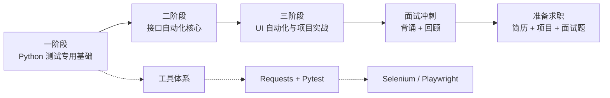

# python-auto-test-study
python自动化测试入门到实战

## 学习路线图




# Python 自动化测试学习
  最终目标：接口测试、UI测试、AI提效

## 目录结构

<!-- PROJECT_STRUCTURE_START -->
```
PythonAutoTest/
├── docs/
│   ├── 01_搭建环境踩坑.md
│   ├── 02_测试理论.md
│   ├── 03_补充.md
│   └── 04_UI测试POM踩坑.md
├── reports/
│   ├── playwright/
│   │   ├── saucedemo_after_login.png
│   │   ├── saucedemo_homepage.png
│   │   ├── saucedemo_order_complete.png
│   │   └── saucedemo_products.png
│   ├── api_test_report.html
│   ├── stage2_final_report.html
│   └── test_report_20260515_204741.txt
├── src/
│   ├── ecommerce_api_test/
│   │   ├── apis/
│   │   │   ├── order_api.py
│   │   │   ├── product_api.py
│   │   │   └── user_api.py
│   │   ├── common/
│   │   │   └── base_api.py
│   │   ├── data/
│   │   │   └── test_data.json
│   │   ├── db/
│   │   ├── test_cases/
│   │   │   ├── test_order.py
│   │   │   ├── test_product.py
│   │   │   └── test_user.py
│   │   ├── utils/
│   │   │   └── db_util.py
│   │   └── conftest.py
│   ├── exercises/
│   │   └── pythonreview/
│   │       ├── data/
│   │       │   ├── config.json
│   │       │   ├── sample.txt
│   │       │   ├── test_cases.json
│   │       │   └── test_data.csv
│   │       ├── 01_variables.py
│   │       ├── 02_datastructure.py
│   │       ├── 03_controlflow.py
│   │       ├── 04_functions.py
│   │       ├── 05_OOPaboutclass.py
│   │       ├── combine123_testdataprocess.py
│   │       ├── combine123_testreports.py
│   │       ├── combine45_classBaseTest.py
│   │       ├── combine45_runtestcase.py
│   │       ├── runner.py
│   │       └── utils.py
│   ├── project_ecommerce/
│   │   ├── conftest.py
│   │   ├── db_example.py
│   │   ├── test_auth.py
│   │   ├── test_negative.py
│   │   ├── test_orders.py
│   │   ├── test_products.py
│   │   └── test_with_allure.py
│   ├── saucedemo_ui_test/
│   │   ├── common/
│   │   │   └── base_page.py
│   │   ├── components/
│   │   │   └── menu_component.py
│   │   ├── data/
│   │   │   └── users.json
│   │   ├── pages/
│   │   │   ├── cart_page.py
│   │   │   ├── checkout_page.py
│   │   │   ├── login_page.py
│   │   │   └── products_page.py
│   │   ├── testcases/
│   │   │   ├── test_cart.py
│   │   │   ├── test_checkout.py
│   │   │   ├── test_login.py
│   │   │   ├── test_menu_functionality.py
│   │   │   └── test_products.py
│   │   └── conftest.py
│   ├── stage1_pytest_core/
│   │   ├── data/
│   │   │   └── test_cases.json
│   │   └── test_cases/
│   │       ├── conftest.py
│   │       ├── test_basic.py
│   │       ├── test_fixture.py
│   │       ├── test_markers.py
│   │       ├── test_mock_external.py
│   │       ├── test_mock.py
│   │       ├── test_parametrize.py
│   │       ├── test_unittest_demo.py
│   │       └── test_user_api.py
│   ├── stage2_api_test/
│   │   ├── data/
│   │   ├── server/
│   │   │   ├── app/
│   │   │   │   ├── main.py
│   │   │   │   └── temp.py
│   │   │   ├── Dockerfile
│   │   │   └── requirements.txt
│   │   └── test_cases/
│   │       ├── conftest.py
│   │       ├── test_auth_fixture.py
│   │       ├── test_auth.py
│   │       ├── test_integration.py
│   │       ├── test_mock_external.py
│   │       ├── test_param_auth.py
│   │       ├── test_schema.py
│   │       └── test_users_crud.py
│   └── stage3_ui_test/
│       ├── conftest.py
│       ├── test_ai_generated.py
│       ├── test_saucedemo_allure.py
│       ├── test_saucedemo_assert.py
│       ├── test_saucedemo_flow.py
│       ├── test_saucedemo_login.py
│       ├── test_saucedemo_selenium.py
│       ├── test_saucedemo.py
│       └── testcases_ai_generated.md
├── docker-compose.yml
├── pytest.ini
├── README.md
├── requirements.txt
├── testgitpush.py
└── update_tree.py

31 directories, 93 files
```
<!-- PROJECT_STRUCTURE_END -->


## 进度
```
- 01 环境搭建完成 ✅
     miniforge+pycharm+git+github
     docker desktop(fastapi+mysql+Jenkins)
     
- 02 Python 基础学习 ✅
     core python programing 书太厚太全面了跟着敲代码还是学了就忘。
     Python 基础语法回顾（面向自动化测试）目标复习自动化测试高频用到的 Python 语法。

- 03 电商接口测试项目实战 ✅
     pytest + requests + pymysql + Allure + Jenkins + Docker
     AOP重构 + 数据库校验
     
- 04 SauceDemo项目实战UI自动化测试 ✅
     playwright实战 (POM + component object)
     selenium稍做了解

- 05 AI自动化测试
     AI提效 dify+DeepSeekv4pro 
     创建工作流,设计测试用例、生成测试代码  ✅
     
     AI测试智能体：
     Hermes自我进化优势突出，但目前尚不稳定 不能落地企业场景
     
     手动搭建可控智能体架构
     LangGraph
        ↓
     控制Agent流程

     LangChain
        ↓
     调用LLM/RAG/Tool Skill（本质就是@tool python代码）

     Playwright
        ↓
     操作浏览器
    
     pytest
        ↓
     执行测试
    
       MCP （代码实现MCP服务器 大脑和手之间的“通用翻译官”和“连接中枢”）
        ↓
     连接外部工具
```

## 测试报告


#### API test: src/ecommerce_api_test
[ecommerce Allure api测试报告](https://felixdi.github.io/python-auto-test-study/api-allure-report/)


#### UI test: src/saucedemo_ui_test
[SauceDemo Allure UI测试报告](https://felixdi.github.io/python-auto-test-study/ui-allure-report/)