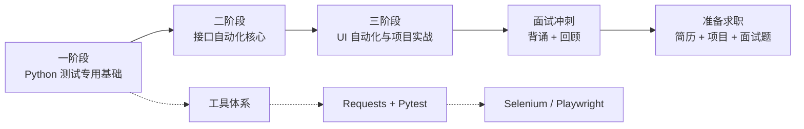

# python-auto-test-study
python自动化测试入门到实战

## 学习路线图




# Python 自动化测试学习
  最终目标：电商实战自动化测试项目 (pytest+requests+playwright)

## 目录结构

<!-- PROJECT_STRUCTURE_START -->
```
PythonAutoTest/
├── docs/
│   ├── 01_搭建环境踩坑.md
│   ├── 02_测试理论.md
│   └── 03_补充.md
├── reports/
│   ├── allure-report/
│   │   ├── data/
│   │   │   ├── attachments/
│   │   │   │   ├── 2ef4b87a206228aa.txt
│   │   │   │   └── ff9599da32e582c6.txt
│   │   │   ├── test-cases/
│   │   │   │   ├── 5176c76f874291d0.json
│   │   │   │   ├── 9825a9eb1cd98777.json
│   │   │   │   └── e6586694188db6e3.json
│   │   │   ├── behaviors.csv
│   │   │   ├── behaviors.json
│   │   │   ├── categories.csv
│   │   │   ├── categories.json
│   │   │   ├── packages.json
│   │   │   ├── suites.csv
│   │   │   ├── suites.json
│   │   │   └── timeline.json
│   │   ├── export/
│   │   │   ├── influxDbData.txt
│   │   │   ├── mail.html
│   │   │   └── prometheusData.txt
│   │   ├── history/
│   │   │   ├── categories-trend.json
│   │   │   ├── duration-trend.json
│   │   │   ├── history-trend.json
│   │   │   ├── history.json
│   │   │   └── retry-trend.json
│   │   ├── plugin/
│   │   │   ├── behaviors/
│   │   │   │   └── index.js
│   │   │   ├── packages/
│   │   │   │   └── index.js
│   │   │   └── screen-diff/
│   │   │       ├── index.js
│   │   │       └── styles.css
│   │   ├── widgets/
│   │   │   ├── behaviors.json
│   │   │   ├── categories-trend.json
│   │   │   ├── categories.json
│   │   │   ├── duration-trend.json
│   │   │   ├── duration.json
│   │   │   ├── environment.json
│   │   │   ├── executors.json
│   │   │   ├── history-trend.json
│   │   │   ├── launch.json
│   │   │   ├── retry-trend.json
│   │   │   ├── severity.json
│   │   │   ├── status-chart.json
│   │   │   ├── suites.json
│   │   │   └── summary.json
│   │   ├── app.js
│   │   ├── favicon.ico
│   │   ├── index.html
│   │   └── styles.css
│   ├── allure-results/
│   │   ├── 13c5affd-308c-4b8e-bae2-4de3fab39436-attachment.txt
│   │   ├── 2aea11b2-9545-45f8-be73-9826dc067a93-result.json
│   │   ├── 46ac0c2c-94a9-4cd6-847f-7df5565e6b96-attachment.txt
│   │   ├── a5cd66ee-226f-441f-8117-97d0ee830a7b-container.json
│   │   ├── aecc7afc-db76-4703-acdd-b05f95284f34-result.json
│   │   ├── bca6700f-4eb1-4cc7-a196-90d50b6f73b3-container.json
│   │   └── c181e6af-2a96-479a-8f2f-bbe88ffd5da8-result.json
│   ├── api_test_report.html
│   ├── stage2_final_report.html
│   └── test_report_20260515_204741.txt
├── src/
│   ├── exercises/
│   │   └── pythonreview/
│   │       ├── data/
│   │       │   ├── config.json
│   │       │   ├── sample.txt
│   │       │   ├── test_cases.json
│   │       │   └── test_data.csv
│   │       ├── 01_variables.py
│   │       ├── 02_datastructure.py
│   │       ├── 03_controlflow.py
│   │       ├── 04_functions.py
│   │       ├── 05_OOPaboutclass.py
│   │       ├── combine123_testdataprocess.py
│   │       ├── combine123_testreports.py
│   │       ├── combine45_classBaseTest.py
│   │       ├── combine45_runtestcase.py
│   │       ├── runner.py
│   │       └── utils.py
│   ├── project_ecommerce/
│   │   ├── conftest.py
│   │   ├── test_db.py
│   │   └── test_with_allure.py
│   ├── stage1_pytest_core/
│   │   ├── data/
│   │   │   └── test_cases.json
│   │   └── test_cases/
│   │       ├── conftest.py
│   │       ├── test_basic.py
│   │       ├── test_fixture.py
│   │       ├── test_markers.py
│   │       ├── test_mock_external.py
│   │       ├── test_mock.py
│   │       ├── test_parametrize.py
│   │       ├── test_unittest_demo.py
│   │       └── test_user_api.py
│   └── stage2_api_test/
│       ├── data/
│       ├── server/
│       │   ├── app/
│       │   │   └── main.py
│       │   ├── Dockerfile
│       │   └── requirements.txt
│       └── test_cases/
│           ├── conftest.py
│           ├── test_auth_fixture.py
│           ├── test_auth.py
│           ├── test_integration.py
│           ├── test_mock_external.py
│           ├── test_param_auth.py
│           ├── test_schema.py
│           └── test_users_crud.py
├── docker-compose.yml
├── pytest.ini
├── README.md
├── requirements.txt
├── testgitpush.py
└── update_tree.py

28 directories, 101 files
```
<!-- PROJECT_STRUCTURE_END -->


## 进度
```
- 01 环境搭建完成 ✅
     miniforge+pycharm+git+github
     docker desktop(fastapi+mysql+jenkins)
     
- 02 Python 基础学习 ✅
     core python programing 书太厚太全面了跟着敲代码还是学了就忘。
     Python 基础语法回顾（面向自动化测试）目标复习自动化测试高频用到的 Python 语法。

- 03 项目实战（接口+UI自动化测试）

- 04 AI自动化测试
     AI提效 opencode+deepseek v4 pro
     playwright+langchain方向
```